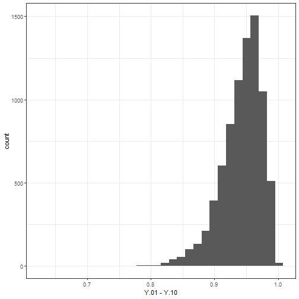

```r
# R code for evaluated code chunks in CausalQueries.qmd
# "Making, Updating, and Querying Causal Models using CausalQueries"
# Till Tietz, Lily Medina, Georgiy Syunyaev, Macartan Humphreys
# Generated using: knitr::spin("code.R")
# 15 November 2023
```

```r
options(kableExtra.latex.load_packages = FALSE)

library(tidyverse)
library(CausalQueries)
library(knitr)
library(rstan)
library(DeclareDesign)
library(kableExtra)
library(tikzDevice)

set.seed(20231018)

## SECTION 2: Motivating example

data("lipids_data")

lipids_data
```
<table class=" lightable-classic-2" style='font-family: "Arial Narrow", "Source Sans Pro", sans-serif; margin-left: auto; margin-right: auto;'>
 <thead>
  <tr>
   <th style="text-align:center;"> query </th>
   <th style="text-align:center;"> given </th>
   <th style="text-align:center;"> mean </th>
   <th style="text-align:center;"> sd </th>
   <th style="text-align:center;"> cred.low </th>
   <th style="text-align:center;"> cred.high </th>
  </tr>
 </thead>
<tbody>
  <tr>
   <td style="text-align:center;"> Y[X=1] - Y[X=0] </td>
   <td style="text-align:center;"> - </td>
   <td style="text-align:center;"> 0.55 </td>
   <td style="text-align:center;"> 0.10 </td>
   <td style="text-align:center;"> 0.37 </td>
   <td style="text-align:center;"> 0.73 </td>
  </tr>
  <tr>
   <td style="text-align:center;"> Y[X=1] - Y[X=0] </td>
   <td style="text-align:center;"> X==0 &amp; Y==0 </td>
   <td style="text-align:center;"> 0.63 </td>
   <td style="text-align:center;"> 0.15 </td>
   <td style="text-align:center;"> 0.37 </td>
   <td style="text-align:center;"> 0.89 </td>
  </tr>
  <tr>
   <td style="text-align:center;"> Y[X=1] - Y[X=0] </td>
   <td style="text-align:center;"> X[Z=1] &gt; X[Z=0] </td>
   <td style="text-align:center;"> 0.70 </td>
   <td style="text-align:center;"> 0.05 </td>
   <td style="text-align:center;"> 0.59 </td>
   <td style="text-align:center;"> 0.81 </td>
  </tr>
</tbody>
</table>
<table class=" lightable-classic-2" style='font-family: "Arial Narrow", "Source Sans Pro", sans-serif; margin-left: auto; margin-right: auto;'>
 <thead>
  <tr>
   <th style="text-align:center;"> node </th>
   <th style="text-align:center;"> nodal_type </th>
   <th style="text-align:center;"> param_set </th>
   <th style="text-align:center;"> param_names </th>
   <th style="text-align:center;"> param_value </th>
   <th style="text-align:center;"> priors </th>
  </tr>
 </thead>
<tbody>
  <tr>
   <td style="text-align:center;"> Z </td>
   <td style="text-align:center;"> 0 </td>
   <td style="text-align:center;"> Z </td>
   <td style="text-align:center;"> Z.0 </td>
   <td style="text-align:center;"> 0.00 </td>
   <td style="text-align:center;"> 1 </td>
  </tr>
  <tr>
   <td style="text-align:center;"> Z </td>
   <td style="text-align:center;"> 1 </td>
   <td style="text-align:center;"> Z </td>
   <td style="text-align:center;"> Z.1 </td>
   <td style="text-align:center;"> 1.00 </td>
   <td style="text-align:center;"> 1 </td>
  </tr>
  <tr>
   <td style="text-align:center;"> X </td>
   <td style="text-align:center;"> 00 </td>
   <td style="text-align:center;"> X </td>
   <td style="text-align:center;"> X.00 </td>
   <td style="text-align:center;"> 0.42 </td>
   <td style="text-align:center;"> 1 </td>
  </tr>
  <tr>
   <td style="text-align:center;"> X </td>
   <td style="text-align:center;"> 10 </td>
   <td style="text-align:center;"> X </td>
   <td style="text-align:center;"> X.10 </td>
   <td style="text-align:center;"> 0.01 </td>
   <td style="text-align:center;"> 1 </td>
  </tr>
  <tr>
   <td style="text-align:center;"> X </td>
   <td style="text-align:center;"> 01 </td>
   <td style="text-align:center;"> X </td>
   <td style="text-align:center;"> X.01 </td>
   <td style="text-align:center;"> 0.03 </td>
   <td style="text-align:center;"> 1 </td>
  </tr>
  <tr>
   <td style="text-align:center;"> X </td>
   <td style="text-align:center;"> 11 </td>
   <td style="text-align:center;"> X </td>
   <td style="text-align:center;"> X.11 </td>
   <td style="text-align:center;"> 0.54 </td>
   <td style="text-align:center;"> 1 </td>
  </tr>
  <tr>
   <td style="text-align:center;"> Y </td>
   <td style="text-align:center;"> 00 </td>
   <td style="text-align:center;"> Y.X.00 </td>
   <td style="text-align:center;"> Y.00_X.00 </td>
   <td style="text-align:center;"> 0.09 </td>
   <td style="text-align:center;"> 1 </td>
  </tr>
  <tr>
   <td style="text-align:center;"> Y </td>
   <td style="text-align:center;"> 10 </td>
   <td style="text-align:center;"> Y.X.00 </td>
   <td style="text-align:center;"> Y.10_X.00 </td>
   <td style="text-align:center;"> 0.57 </td>
   <td style="text-align:center;"> 1 </td>
  </tr>
  <tr>
   <td style="text-align:center;"> Y </td>
   <td style="text-align:center;"> 01 </td>
   <td style="text-align:center;"> Y.X.00 </td>
   <td style="text-align:center;"> Y.01_X.00 </td>
   <td style="text-align:center;"> 0.12 </td>
   <td style="text-align:center;"> 1 </td>
  </tr>
  <tr>
   <td style="text-align:center;"> Y </td>
   <td style="text-align:center;"> 11 </td>
   <td style="text-align:center;"> Y.X.00 </td>
   <td style="text-align:center;"> Y.11_X.00 </td>
   <td style="text-align:center;"> 0.23 </td>
   <td style="text-align:center;"> 1 </td>
  </tr>
  <tr>
   <td style="text-align:center;"> Y </td>
   <td style="text-align:center;"> 00 </td>
   <td style="text-align:center;"> Y.X.01 </td>
   <td style="text-align:center;"> Y.00_X.01 </td>
   <td style="text-align:center;"> 0.64 </td>
   <td style="text-align:center;"> 1 </td>
  </tr>
  <tr>
   <td style="text-align:center;"> Y </td>
   <td style="text-align:center;"> 10 </td>
   <td style="text-align:center;"> Y.X.01 </td>
   <td style="text-align:center;"> Y.10_X.01 </td>
   <td style="text-align:center;"> 0.09 </td>
   <td style="text-align:center;"> 1 </td>
  </tr>
  <tr>
   <td style="text-align:center;"> Y </td>
   <td style="text-align:center;"> 01 </td>
   <td style="text-align:center;"> Y.X.01 </td>
   <td style="text-align:center;"> Y.01_X.01 </td>
   <td style="text-align:center;"> 0.26 </td>
   <td style="text-align:center;"> 1 </td>
  </tr>
  <tr>
   <td style="text-align:center;"> Y </td>
   <td style="text-align:center;"> 11 </td>
   <td style="text-align:center;"> Y.X.01 </td>
   <td style="text-align:center;"> Y.11_X.01 </td>
   <td style="text-align:center;"> 0.01 </td>
   <td style="text-align:center;"> 1 </td>
  </tr>
  <tr>
   <td style="text-align:center;"> Y </td>
   <td style="text-align:center;"> 00 </td>
   <td style="text-align:center;"> Y.X.10 </td>
   <td style="text-align:center;"> Y.00_X.10 </td>
   <td style="text-align:center;"> 0.31 </td>
   <td style="text-align:center;"> 1 </td>
  </tr>
  <tr>
   <td style="text-align:center;"> Y </td>
   <td style="text-align:center;"> 10 </td>
   <td style="text-align:center;"> Y.X.10 </td>
   <td style="text-align:center;"> Y.10_X.10 </td>
   <td style="text-align:center;"> 0.25 </td>
   <td style="text-align:center;"> 1 </td>
  </tr>
  <tr>
   <td style="text-align:center;"> Y </td>
   <td style="text-align:center;"> 01 </td>
   <td style="text-align:center;"> Y.X.10 </td>
   <td style="text-align:center;"> Y.01_X.10 </td>
   <td style="text-align:center;"> 0.14 </td>
   <td style="text-align:center;"> 1 </td>
  </tr>
  <tr>
   <td style="text-align:center;"> Y </td>
   <td style="text-align:center;"> 11 </td>
   <td style="text-align:center;"> Y.X.10 </td>
   <td style="text-align:center;"> Y.11_X.10 </td>
   <td style="text-align:center;"> 0.30 </td>
   <td style="text-align:center;"> 1 </td>
  </tr>
  <tr>
   <td style="text-align:center;"> Y </td>
   <td style="text-align:center;"> 00 </td>
   <td style="text-align:center;"> Y.X.11 </td>
   <td style="text-align:center;"> Y.00_X.11 </td>
   <td style="text-align:center;"> 0.14 </td>
   <td style="text-align:center;"> 1 </td>
  </tr>
  <tr>
   <td style="text-align:center;"> Y </td>
   <td style="text-align:center;"> 10 </td>
   <td style="text-align:center;"> Y.X.11 </td>
   <td style="text-align:center;"> Y.10_X.11 </td>
   <td style="text-align:center;"> 0.26 </td>
   <td style="text-align:center;"> 1 </td>
  </tr>
  <tr>
   <td style="text-align:center;"> Y </td>
   <td style="text-align:center;"> 01 </td>
   <td style="text-align:center;"> Y.X.11 </td>
   <td style="text-align:center;"> Y.01_X.11 </td>
   <td style="text-align:center;"> 0.20 </td>
   <td style="text-align:center;"> 1 </td>
  </tr>
  <tr>
   <td style="text-align:center;"> Y </td>
   <td style="text-align:center;"> 11 </td>
   <td style="text-align:center;"> Y.X.11 </td>
   <td style="text-align:center;"> Y.11_X.11 </td>
   <td style="text-align:center;"> 0.41 </td>
   <td style="text-align:center;"> 1 </td>
  </tr>
</tbody>
</table>

```r
model <- make_model("X -> M -> Y <- X")
```


<table class=" lightable-classic-2" style='font-family: "Arial Narrow", "Source Sans Pro", sans-serif; margin-left: auto; margin-right: auto;'>
 <thead>
  <tr>
   <th style="text-align:center;"> param_names </th>
   <th style="text-align:center;"> node </th>
   <th style="text-align:center;"> gen </th>
   <th style="text-align:center;"> param_set </th>
   <th style="text-align:center;"> nodal_type </th>
   <th style="text-align:center;"> given </th>
   <th style="text-align:center;"> param_value </th>
   <th style="text-align:center;"> priors </th>
  </tr>
 </thead>
<tbody>
  <tr>
   <td style="text-align:center;"> X.0 </td>
   <td style="text-align:center;"> X </td>
   <td style="text-align:center;"> 1 </td>
   <td style="text-align:center;"> X </td>
   <td style="text-align:center;"> 0 </td>
   <td style="text-align:center;">  </td>
   <td style="text-align:center;"> 0.50 </td>
   <td style="text-align:center;"> 1 </td>
  </tr>
  <tr>
   <td style="text-align:center;"> X.1 </td>
   <td style="text-align:center;"> X </td>
   <td style="text-align:center;"> 1 </td>
   <td style="text-align:center;"> X </td>
   <td style="text-align:center;"> 1 </td>
   <td style="text-align:center;">  </td>
   <td style="text-align:center;"> 0.50 </td>
   <td style="text-align:center;"> 1 </td>
  </tr>
  <tr>
   <td style="text-align:center;"> Y.00 </td>
   <td style="text-align:center;"> Y </td>
   <td style="text-align:center;"> 2 </td>
   <td style="text-align:center;"> Y </td>
   <td style="text-align:center;"> 00 </td>
   <td style="text-align:center;">  </td>
   <td style="text-align:center;"> 0.25 </td>
   <td style="text-align:center;"> 1 </td>
  </tr>
  <tr>
   <td style="text-align:center;"> Y.10 </td>
   <td style="text-align:center;"> Y </td>
   <td style="text-align:center;"> 2 </td>
   <td style="text-align:center;"> Y </td>
   <td style="text-align:center;"> 10 </td>
   <td style="text-align:center;">  </td>
   <td style="text-align:center;"> 0.25 </td>
   <td style="text-align:center;"> 1 </td>
  </tr>
  <tr>
   <td style="text-align:center;"> Y.01 </td>
   <td style="text-align:center;"> Y </td>
   <td style="text-align:center;"> 2 </td>
   <td style="text-align:center;"> Y </td>
   <td style="text-align:center;"> 01 </td>
   <td style="text-align:center;">  </td>
   <td style="text-align:center;"> 0.25 </td>
   <td style="text-align:center;"> 1 </td>
  </tr>
  <tr>
   <td style="text-align:center;"> Y.11 </td>
   <td style="text-align:center;"> Y </td>
   <td style="text-align:center;"> 2 </td>
   <td style="text-align:center;"> Y </td>
   <td style="text-align:center;"> 11 </td>
   <td style="text-align:center;">  </td>
   <td style="text-align:center;"> 0.25 </td>
   <td style="text-align:center;"> 1 </td>
  </tr>
</tbody>
</table>

```r
interpretations <-
  make_model("X -> Y <- M; W -> Y") |>
  interpret_type()

interpretations$Y
```

```r
lipids_model$causal_types |> head()
```

```r
make_model("X -> Y") |> get_parameter_matrix()
```

```
## 
## Rows are parameters, grouped in parameter sets
## 
## Columns are causal types
## 
## Cell entries indicate whether a parameter probability is used
## in the calculation of causal type probability
## 
## 
##  
##  param_set  (P)
## 
```

```r
model_restricted <-
  make_model("Z -> X -> Y; X <-> Y") |>
  set_restrictions("X[Z=1] < X[Z=0]")
```
<table class=" lightable-classic-2" style='font-family: "Arial Narrow", "Source Sans Pro", sans-serif; margin-left: auto; margin-right: auto;'>
 <thead>
  <tr>
   <th style="text-align:center;"> param_names </th>
   <th style="text-align:center;"> node </th>
   <th style="text-align:center;"> gen </th>
   <th style="text-align:center;"> param_set </th>
   <th style="text-align:center;"> nodal_type </th>
   <th style="text-align:center;"> given </th>
   <th style="text-align:center;"> param_value </th>
   <th style="text-align:center;"> priors </th>
  </tr>
 </thead>
<tbody>
  <tr>
   <td style="text-align:center;"> X.0 </td>
   <td style="text-align:center;"> X </td>
   <td style="text-align:center;"> 1 </td>
   <td style="text-align:center;"> X </td>
   <td style="text-align:center;"> 0 </td>
   <td style="text-align:center;">  </td>
   <td style="text-align:center;"> 0.50 </td>
   <td style="text-align:center;"> 1 </td>
  </tr>
  <tr>
   <td style="text-align:center;"> X.1 </td>
   <td style="text-align:center;"> X </td>
   <td style="text-align:center;"> 1 </td>
   <td style="text-align:center;"> X </td>
   <td style="text-align:center;"> 1 </td>
   <td style="text-align:center;">  </td>
   <td style="text-align:center;"> 0.50 </td>
   <td style="text-align:center;"> 1 </td>
  </tr>
  <tr>
   <td style="text-align:center;"> Y.00_X.0 </td>
   <td style="text-align:center;"> Y </td>
   <td style="text-align:center;"> 2 </td>
   <td style="text-align:center;"> Y.X.0 </td>
   <td style="text-align:center;"> 00 </td>
   <td style="text-align:center;"> X.0 </td>
   <td style="text-align:center;"> 0.25 </td>
   <td style="text-align:center;"> 1 </td>
  </tr>
  <tr>
   <td style="text-align:center;"> Y.10_X.0 </td>
   <td style="text-align:center;"> Y </td>
   <td style="text-align:center;"> 2 </td>
   <td style="text-align:center;"> Y.X.0 </td>
   <td style="text-align:center;"> 10 </td>
   <td style="text-align:center;"> X.0 </td>
   <td style="text-align:center;"> 0.25 </td>
   <td style="text-align:center;"> 1 </td>
  </tr>
  <tr>
   <td style="text-align:center;"> Y.01_X.0 </td>
   <td style="text-align:center;"> Y </td>
   <td style="text-align:center;"> 2 </td>
   <td style="text-align:center;"> Y.X.0 </td>
   <td style="text-align:center;"> 01 </td>
   <td style="text-align:center;"> X.0 </td>
   <td style="text-align:center;"> 0.25 </td>
   <td style="text-align:center;"> 1 </td>
  </tr>
  <tr>
   <td style="text-align:center;"> Y.11_X.0 </td>
   <td style="text-align:center;"> Y </td>
   <td style="text-align:center;"> 2 </td>
   <td style="text-align:center;"> Y.X.0 </td>
   <td style="text-align:center;"> 11 </td>
   <td style="text-align:center;"> X.0 </td>
   <td style="text-align:center;"> 0.25 </td>
   <td style="text-align:center;"> 1 </td>
  </tr>
  <tr>
   <td style="text-align:center;"> Y.00_X.1 </td>
   <td style="text-align:center;"> Y </td>
   <td style="text-align:center;"> 2 </td>
   <td style="text-align:center;"> Y.X.1 </td>
   <td style="text-align:center;"> 00 </td>
   <td style="text-align:center;"> X.1 </td>
   <td style="text-align:center;"> 0.25 </td>
   <td style="text-align:center;"> 1 </td>
  </tr>
  <tr>
   <td style="text-align:center;"> Y.10_X.1 </td>
   <td style="text-align:center;"> Y </td>
   <td style="text-align:center;"> 2 </td>
   <td style="text-align:center;"> Y.X.1 </td>
   <td style="text-align:center;"> 10 </td>
   <td style="text-align:center;"> X.1 </td>
   <td style="text-align:center;"> 0.25 </td>
   <td style="text-align:center;"> 1 </td>
  </tr>
  <tr>
   <td style="text-align:center;"> Y.01_X.1 </td>
   <td style="text-align:center;"> Y </td>
   <td style="text-align:center;"> 2 </td>
   <td style="text-align:center;"> Y.X.1 </td>
   <td style="text-align:center;"> 01 </td>
   <td style="text-align:center;"> X.1 </td>
   <td style="text-align:center;"> 0.25 </td>
   <td style="text-align:center;"> 1 </td>
  </tr>
  <tr>
   <td style="text-align:center;"> Y.11_X.1 </td>
   <td style="text-align:center;"> Y </td>
   <td style="text-align:center;"> 2 </td>
   <td style="text-align:center;"> Y.X.1 </td>
   <td style="text-align:center;"> 11 </td>
   <td style="text-align:center;"> X.1 </td>
   <td style="text-align:center;"> 0.25 </td>
   <td style="text-align:center;"> 1 </td>
  </tr>
</tbody>
</table>
<table class=" lightable-classic-2" style='font-family: "Arial Narrow", "Source Sans Pro", sans-serif; margin-left: auto; margin-right: auto;'>
 <thead>
  <tr>
   <th style="text-align:left;">   </th>
   <th style="text-align:center;"> X0.Y00 </th>
   <th style="text-align:center;"> X1.Y00 </th>
   <th style="text-align:center;"> X0.Y10 </th>
   <th style="text-align:center;"> X1.Y10 </th>
   <th style="text-align:center;"> X0.Y01 </th>
   <th style="text-align:center;"> X1.Y01 </th>
   <th style="text-align:center;"> X0.Y11 </th>
   <th style="text-align:center;"> X1.Y11 </th>
  </tr>
 </thead>
<tbody>
  <tr>
   <td style="text-align:left;"> X.0 </td>
   <td style="text-align:center;"> 1 </td>
   <td style="text-align:center;"> 0 </td>
   <td style="text-align:center;"> 1 </td>
   <td style="text-align:center;"> 0 </td>
   <td style="text-align:center;"> 1 </td>
   <td style="text-align:center;"> 0 </td>
   <td style="text-align:center;"> 1 </td>
   <td style="text-align:center;"> 0 </td>
  </tr>
  <tr>
   <td style="text-align:left;"> X.1 </td>
   <td style="text-align:center;"> 0 </td>
   <td style="text-align:center;"> 1 </td>
   <td style="text-align:center;"> 0 </td>
   <td style="text-align:center;"> 1 </td>
   <td style="text-align:center;"> 0 </td>
   <td style="text-align:center;"> 1 </td>
   <td style="text-align:center;"> 0 </td>
   <td style="text-align:center;"> 1 </td>
  </tr>
  <tr>
   <td style="text-align:left;"> Y.00_X.0 </td>
   <td style="text-align:center;"> 1 </td>
   <td style="text-align:center;"> 0 </td>
   <td style="text-align:center;"> 0 </td>
   <td style="text-align:center;"> 0 </td>
   <td style="text-align:center;"> 0 </td>
   <td style="text-align:center;"> 0 </td>
   <td style="text-align:center;"> 0 </td>
   <td style="text-align:center;"> 0 </td>
  </tr>
  <tr>
   <td style="text-align:left;"> Y.10_X.0 </td>
   <td style="text-align:center;"> 0 </td>
   <td style="text-align:center;"> 0 </td>
   <td style="text-align:center;"> 1 </td>
   <td style="text-align:center;"> 0 </td>
   <td style="text-align:center;"> 0 </td>
   <td style="text-align:center;"> 0 </td>
   <td style="text-align:center;"> 0 </td>
   <td style="text-align:center;"> 0 </td>
  </tr>
  <tr>
   <td style="text-align:left;"> Y.01_X.0 </td>
   <td style="text-align:center;"> 0 </td>
   <td style="text-align:center;"> 0 </td>
   <td style="text-align:center;"> 0 </td>
   <td style="text-align:center;"> 0 </td>
   <td style="text-align:center;"> 1 </td>
   <td style="text-align:center;"> 0 </td>
   <td style="text-align:center;"> 0 </td>
   <td style="text-align:center;"> 0 </td>
  </tr>
  <tr>
   <td style="text-align:left;"> Y.11_X.0 </td>
   <td style="text-align:center;"> 0 </td>
   <td style="text-align:center;"> 0 </td>
   <td style="text-align:center;"> 0 </td>
   <td style="text-align:center;"> 0 </td>
   <td style="text-align:center;"> 0 </td>
   <td style="text-align:center;"> 0 </td>
   <td style="text-align:center;"> 1 </td>
   <td style="text-align:center;"> 0 </td>
  </tr>
  <tr>
   <td style="text-align:left;"> Y.00_X.1 </td>
   <td style="text-align:center;"> 0 </td>
   <td style="text-align:center;"> 1 </td>
   <td style="text-align:center;"> 0 </td>
   <td style="text-align:center;"> 0 </td>
   <td style="text-align:center;"> 0 </td>
   <td style="text-align:center;"> 0 </td>
   <td style="text-align:center;"> 0 </td>
   <td style="text-align:center;"> 0 </td>
  </tr>
  <tr>
   <td style="text-align:left;"> Y.10_X.1 </td>
   <td style="text-align:center;"> 0 </td>
   <td style="text-align:center;"> 0 </td>
   <td style="text-align:center;"> 0 </td>
   <td style="text-align:center;"> 1 </td>
   <td style="text-align:center;"> 0 </td>
   <td style="text-align:center;"> 0 </td>
   <td style="text-align:center;"> 0 </td>
   <td style="text-align:center;"> 0 </td>
  </tr>
  <tr>
   <td style="text-align:left;"> Y.01_X.1 </td>
   <td style="text-align:center;"> 0 </td>
   <td style="text-align:center;"> 0 </td>
   <td style="text-align:center;"> 0 </td>
   <td style="text-align:center;"> 0 </td>
   <td style="text-align:center;"> 0 </td>
   <td style="text-align:center;"> 1 </td>
   <td style="text-align:center;"> 0 </td>
   <td style="text-align:center;"> 0 </td>
  </tr>
  <tr>
   <td style="text-align:left;"> Y.11_X.1 </td>
   <td style="text-align:center;"> 0 </td>
   <td style="text-align:center;"> 0 </td>
   <td style="text-align:center;"> 0 </td>
   <td style="text-align:center;"> 0 </td>
   <td style="text-align:center;"> 0 </td>
   <td style="text-align:center;"> 0 </td>
   <td style="text-align:center;"> 0 </td>
   <td style="text-align:center;"> 1 </td>
  </tr>
</tbody>
</table>
<table>
 <thead>
  <tr>
   <th style="text-align:left;"> Model </th>
   <th style="text-align:center;"> dof </th>
  </tr>
 </thead>
<tbody>
  <tr>
   <td style="text-align:left;"> X -&gt; Y &lt;- W </td>
   <td style="text-align:center;"> 17 </td>
  </tr>
  <tr>
   <td style="text-align:left;"> X -&gt; Y &lt;- W; X &lt;-&gt; W </td>
   <td style="text-align:center;"> 18 </td>
  </tr>
  <tr>
   <td style="text-align:left;"> X -&gt; Y &lt;- W; X &lt;-&gt; Y; W &lt;-&gt; Y </td>
   <td style="text-align:center;"> 62 </td>
  </tr>
  <tr>
   <td style="text-align:left;"> X -&gt; Y &lt;- W; X &lt;-&gt; Y; W &lt;-&gt; Y; X &lt;-&gt;W </td>
   <td style="text-align:center;"> 63 </td>
  </tr>
  <tr>
   <td style="text-align:left;"> X -&gt; W -&gt; Y &lt;- X </td>
   <td style="text-align:center;"> 19 </td>
  </tr>
  <tr>
   <td style="text-align:left;"> X -&gt; W -&gt; Y &lt;- X; W &lt;-&gt; Y </td>
   <td style="text-align:center;"> 64 </td>
  </tr>
  <tr>
   <td style="text-align:left;"> X -&gt; W -&gt; Y &lt;- X; X &lt;-&gt; W; W &lt;-&gt; Y </td>
   <td style="text-align:center;"> 67 </td>
  </tr>
  <tr>
   <td style="text-align:left;"> X -&gt; W -&gt; Y &lt;- X; X &lt;-&gt; W; W &lt;-&gt; Y; X &lt;-&gt; Y </td>
   <td style="text-align:center;"> 127 </td>
  </tr>
</tbody>
</table>

```r
make_model("X -> Y") |> get_priors()
```

```
##  X.0  X.1 Y.00 Y.10 Y.01 Y.11 
##    1    1    1    1    1    1
```

```r
make_model("X -> Y") |>
  set_priors(1:6) |>
  get_priors()
```

```
##  X.0  X.1 Y.00 Y.10 Y.01 Y.11 
##    1    2    3    4    5    6
```

```r
make_model("X -> Y") |>
  set_priors(statement = "Y[X=1] > Y[X=0]", alphas = 3) |>
  get_priors()
```

```
##  X.0  X.1 Y.00 Y.10 Y.01 Y.11 
##    1    1    1    1    3    1
```

```r
make_model("X -> Y") |>
  get_parameters()
```

```
##  X.0  X.1 Y.00 Y.10 Y.01 Y.11 
## 0.50 0.50 0.25 0.25 0.25 0.25
```

```r
make_model("X -> Y") |>
  set_parameters(statement = "Y[X=1] > Y[X=0]", parameters = .5) |>
  get_parameters()
```

```
##       X.0       X.1      Y.00      Y.10      Y.01      Y.11 
## 0.5000000 0.5000000 0.1666667 0.1666667 0.5000000 0.1666667
```

```r
model <- make_model("X -> M -> Y")
```

```r
sample_data_1 <-
  model |>
  make_data(n = 4)
```

```r
make_data(model, n = 3, param_type = "prior_draw")
```

```r
sample_data_2 <-
  make_data(
    model,
    n = 8,
    nodes = list(c("X", "Y"), "M"),
    probs = list(1, .5),
    subsets = list(TRUE, "X==1 & Y==0"),
    verbose = FALSE
  )

sample_data_2
```

```r
sample_data_2 |> collapse_data(model)


## SECTION 6: Updating models
```
<table class=" lightable-classic-2" style='font-family: "Arial Narrow", "Source Sans Pro", sans-serif; margin-left: auto; margin-right: auto;'>
 <thead>
  <tr>
   <th style="text-align:left;">   </th>
   <th style="text-align:center;"> X0Y0 </th>
   <th style="text-align:center;"> X1Y0 </th>
   <th style="text-align:center;"> X0Y1 </th>
   <th style="text-align:center;"> X1Y1 </th>
  </tr>
 </thead>
<tbody>
  <tr>
   <td style="text-align:left;"> X.0 </td>
   <td style="text-align:center;"> 1 </td>
   <td style="text-align:center;"> 0 </td>
   <td style="text-align:center;"> 1 </td>
   <td style="text-align:center;"> 0 </td>
  </tr>
  <tr>
   <td style="text-align:left;"> X.1 </td>
   <td style="text-align:center;"> 0 </td>
   <td style="text-align:center;"> 1 </td>
   <td style="text-align:center;"> 0 </td>
   <td style="text-align:center;"> 1 </td>
  </tr>
  <tr>
   <td style="text-align:left;"> Y.00 </td>
   <td style="text-align:center;"> 1 </td>
   <td style="text-align:center;"> 1 </td>
   <td style="text-align:center;"> 0 </td>
   <td style="text-align:center;"> 0 </td>
  </tr>
  <tr>
   <td style="text-align:left;"> Y.10 </td>
   <td style="text-align:center;"> 0 </td>
   <td style="text-align:center;"> 1 </td>
   <td style="text-align:center;"> 1 </td>
   <td style="text-align:center;"> 0 </td>
  </tr>
  <tr>
   <td style="text-align:left;"> Y.01 </td>
   <td style="text-align:center;"> 1 </td>
   <td style="text-align:center;"> 0 </td>
   <td style="text-align:center;"> 0 </td>
   <td style="text-align:center;"> 1 </td>
  </tr>
  <tr>
   <td style="text-align:left;"> Y.11 </td>
   <td style="text-align:center;"> 0 </td>
   <td style="text-align:center;"> 0 </td>
   <td style="text-align:center;"> 1 </td>
   <td style="text-align:center;"> 1 </td>
  </tr>
</tbody>
</table>
<table class=" lightable-classic-2" style='font-family: "Arial Narrow", "Source Sans Pro", sans-serif; margin-left: auto; margin-right: auto;'>
 <thead>
  <tr>
   <th style="text-align:center;"> model </th>
   <th style="text-align:center;"> query </th>
   <th style="text-align:center;"> mean </th>
   <th style="text-align:center;"> sd </th>
  </tr>
 </thead>
<tbody>
  <tr>
   <td style="text-align:center;"> uncensored </td>
   <td style="text-align:center;"> (Y[X=1] - Y[X=0]) </td>
   <td style="text-align:center;"> 0.59 </td>
   <td style="text-align:center;"> 0.20 </td>
  </tr>
  <tr>
   <td style="text-align:center;"> censored </td>
   <td style="text-align:center;"> (Y[X=1] - Y[X=0]) </td>
   <td style="text-align:center;"> 0.01 </td>
   <td style="text-align:center;"> 0.32 </td>
  </tr>
</tbody>
</table>

```r
make_model("X -> Y") |> realise_outcomes()
```

```r
make_model("X -> Y") |> realise_outcomes(dos = list(X = 1))
```

```r
make_model("X -> Y")  |> get_query_types("Y==1")
```

```
## 
## Causal types satisfying query's condition(s)  
## 
##  query =  Y==1 
## 
## X0.Y10  X1.Y01
## X0.Y11  X1.Y11
## 
## 
##  Number of causal types that meet condition(s) =  4
##  Total number of causal types in model =  8
```

```r
make_model("X -> Y")  |> get_query_types("Y[X=1]==1")
```

```
## 
## Causal types satisfying query's condition(s)  
## 
##  query =  Y[X=1]==1 
## 
## X0.Y01  X1.Y01
## X0.Y11  X1.Y11
## 
## 
##  Number of causal types that meet condition(s) =  4
##  Total number of causal types in model =  8
```

```r
make_model("X1 -> Y <- X2")  |>
  get_query_types("X1==1 & X2==1 & (Y[X1=1, X2=1] > Y[X1=0, X2=0])")
```

```
## 
## Causal types satisfying query's condition(s)  
## 
##  query =  X1==1&X2==1&(Y[X1=1,X2=1]>Y[X1=0,X2=0]) 
## 
## X11.X21.Y0001  X11.X21.Y0101
## X11.X21.Y0011  X11.X21.Y0111
## 
## 
##  Number of causal types that meet condition(s) =  4
##  Total number of causal types in model =  64
```

```r
make_model("X -> Y")  |> get_query_types("Y[X=1] - Y[X=0]")
```

```
## X0.Y00 X1.Y00 X0.Y10 X1.Y10 X0.Y01 X1.Y01 X0.Y11 X1.Y11 
##      0      0     -1     -1      1      1      0      0
```

```
## `stat_bin()` using `bins = 30`. Pick better value with `binwidth`.
```

<div class="figure" style="text-align: center">

<p class="caption">Posterior on "Probability $Y$ is increasing in $X$".</p>
</div>
<table class=" lightable-classic-2" style='font-family: "Arial Narrow", "Source Sans Pro", sans-serif; margin-left: auto; margin-right: auto;'>
 <thead>
  <tr>
   <th style="text-align:center;"> query </th>
   <th style="text-align:center;"> given </th>
   <th style="text-align:center;"> mean </th>
   <th style="text-align:center;"> sd </th>
   <th style="text-align:center;"> cred.low </th>
   <th style="text-align:center;"> cred.high </th>
  </tr>
 </thead>
<tbody>
  <tr>
   <td style="text-align:center;"> Y[X=1] - Y[X=0] </td>
   <td style="text-align:center;"> X==1 &amp; Y==1 &amp; Z==1 </td>
   <td style="text-align:center;"> 0.95 </td>
   <td style="text-align:center;"> 0.04 </td>
   <td style="text-align:center;"> 0.86 </td>
   <td style="text-align:center;"> 1 </td>
  </tr>
</tbody>
</table>

```
## 
## SAMPLING FOR MODEL 'simplexes' NOW (CHAIN 1).
## Chain 1: 
## Chain 1: Gradient evaluation took 2.4e-05 seconds
## Chain 1: 1000 transitions using 10 leapfrog steps per transition would take 0.24 seconds.
## Chain 1: Adjust your expectations accordingly!
## Chain 1: 
## Chain 1: 
## Chain 1: Iteration:    1 / 10000 [  0%]  (Warmup)
## Chain 1: Iteration: 1000 / 10000 [ 10%]  (Warmup)
## Chain 1: Iteration: 2000 / 10000 [ 20%]  (Warmup)
## Chain 1: Iteration: 3000 / 10000 [ 30%]  (Warmup)
## Chain 1: Iteration: 4000 / 10000 [ 40%]  (Warmup)
## Chain 1: Iteration: 5000 / 10000 [ 50%]  (Warmup)
## Chain 1: Iteration: 5001 / 10000 [ 50%]  (Sampling)
## Chain 1: Iteration: 6000 / 10000 [ 60%]  (Sampling)
## Chain 1: Iteration: 7000 / 10000 [ 70%]  (Sampling)
## Chain 1: Iteration: 8000 / 10000 [ 80%]  (Sampling)
## Chain 1: Iteration: 9000 / 10000 [ 90%]  (Sampling)
## Chain 1: Iteration: 10000 / 10000 [100%]  (Sampling)
## Chain 1: 
## Chain 1:  Elapsed Time: 1.224 seconds (Warm-up)
## Chain 1:                1.303 seconds (Sampling)
## Chain 1:                2.527 seconds (Total)
## Chain 1: 
## 
## SAMPLING FOR MODEL 'simplexes' NOW (CHAIN 2).
## Chain 2: 
## Chain 2: Gradient evaluation took 3.8e-05 seconds
## Chain 2: 1000 transitions using 10 leapfrog steps per transition would take 0.38 seconds.
## Chain 2: Adjust your expectations accordingly!
## Chain 2: 
## Chain 2: 
## Chain 2: Iteration:    1 / 10000 [  0%]  (Warmup)
## Chain 2: Iteration: 1000 / 10000 [ 10%]  (Warmup)
## Chain 2: Iteration: 2000 / 10000 [ 20%]  (Warmup)
## Chain 2: Iteration: 3000 / 10000 [ 30%]  (Warmup)
## Chain 2: Iteration: 4000 / 10000 [ 40%]  (Warmup)
## Chain 2: Iteration: 5000 / 10000 [ 50%]  (Warmup)
## Chain 2: Iteration: 5001 / 10000 [ 50%]  (Sampling)
## Chain 2: Iteration: 6000 / 10000 [ 60%]  (Sampling)
## Chain 2: Iteration: 7000 / 10000 [ 70%]  (Sampling)
## Chain 2: Iteration: 8000 / 10000 [ 80%]  (Sampling)
## Chain 2: Iteration: 9000 / 10000 [ 90%]  (Sampling)
## Chain 2: Iteration: 10000 / 10000 [100%]  (Sampling)
## Chain 2: 
## Chain 2:  Elapsed Time: 1.209 seconds (Warm-up)
## Chain 2:                1.291 seconds (Sampling)
## Chain 2:                2.5 seconds (Total)
## Chain 2: 
## 
## SAMPLING FOR MODEL 'simplexes' NOW (CHAIN 3).
## Chain 3: 
## Chain 3: Gradient evaluation took 2.2e-05 seconds
## Chain 3: 1000 transitions using 10 leapfrog steps per transition would take 0.22 seconds.
## Chain 3: Adjust your expectations accordingly!
## Chain 3: 
## Chain 3: 
## Chain 3: Iteration:    1 / 10000 [  0%]  (Warmup)
## Chain 3: Iteration: 1000 / 10000 [ 10%]  (Warmup)
## Chain 3: Iteration: 2000 / 10000 [ 20%]  (Warmup)
## Chain 3: Iteration: 3000 / 10000 [ 30%]  (Warmup)
## Chain 3: Iteration: 4000 / 10000 [ 40%]  (Warmup)
## Chain 3: Iteration: 5000 / 10000 [ 50%]  (Warmup)
## Chain 3: Iteration: 5001 / 10000 [ 50%]  (Sampling)
## Chain 3: Iteration: 6000 / 10000 [ 60%]  (Sampling)
## Chain 3: Iteration: 7000 / 10000 [ 70%]  (Sampling)
## Chain 3: Iteration: 8000 / 10000 [ 80%]  (Sampling)
## Chain 3: Iteration: 9000 / 10000 [ 90%]  (Sampling)
## Chain 3: Iteration: 10000 / 10000 [100%]  (Sampling)
## Chain 3: 
## Chain 3:  Elapsed Time: 1.235 seconds (Warm-up)
## Chain 3:                1.355 seconds (Sampling)
## Chain 3:                2.59 seconds (Total)
## Chain 3: 
## 
## SAMPLING FOR MODEL 'simplexes' NOW (CHAIN 4).
## Chain 4: 
## Chain 4: Gradient evaluation took 2.3e-05 seconds
## Chain 4: 1000 transitions using 10 leapfrog steps per transition would take 0.23 seconds.
## Chain 4: Adjust your expectations accordingly!
## Chain 4: 
## Chain 4: 
## Chain 4: Iteration:    1 / 10000 [  0%]  (Warmup)
## Chain 4: Iteration: 1000 / 10000 [ 10%]  (Warmup)
## Chain 4: Iteration: 2000 / 10000 [ 20%]  (Warmup)
## Chain 4: Iteration: 3000 / 10000 [ 30%]  (Warmup)
## Chain 4: Iteration: 4000 / 10000 [ 40%]  (Warmup)
## Chain 4: Iteration: 5000 / 10000 [ 50%]  (Warmup)
## Chain 4: Iteration: 5001 / 10000 [ 50%]  (Sampling)
## Chain 4: Iteration: 6000 / 10000 [ 60%]  (Sampling)
## Chain 4: Iteration: 7000 / 10000 [ 70%]  (Sampling)
## Chain 4: Iteration: 8000 / 10000 [ 80%]  (Sampling)
## Chain 4: Iteration: 9000 / 10000 [ 90%]  (Sampling)
## Chain 4: Iteration: 10000 / 10000 [100%]  (Sampling)
## Chain 4: 
## Chain 4:  Elapsed Time: 1.205 seconds (Warm-up)
## Chain 4:                1.344 seconds (Sampling)
## Chain 4:                2.549 seconds (Total)
## Chain 4:
```

<table class=" lightable-classic-2" style='font-family: "Arial Narrow", "Source Sans Pro", sans-serif; margin-left: auto; margin-right: auto;'>
 <thead>
  <tr>
   <th style="text-align:center;"> query </th>
   <th style="text-align:center;"> given </th>
   <th style="text-align:center;"> case_level </th>
   <th style="text-align:center;"> mean </th>
   <th style="text-align:center;"> sd </th>
  </tr>
 </thead>
<tbody>
  <tr>
   <td style="text-align:center;"> Y[X=1] &gt; Y[X=0] </td>
   <td style="text-align:center;"> X==1 &amp; Y==1 &amp; M==1 </td>
   <td style="text-align:center;"> TRUE </td>
   <td style="text-align:center;"> 0.67 </td>
   <td style="text-align:center;"> NA </td>
  </tr>
  <tr>
   <td style="text-align:center;"> Y[X=1] &gt; Y[X=0] </td>
   <td style="text-align:center;"> X==1 &amp; Y==1 &amp; M==1 </td>
   <td style="text-align:center;"> FALSE </td>
   <td style="text-align:center;"> 0.43 </td>
   <td style="text-align:center;"> 0.33 </td>
  </tr>
</tbody>
</table>
<table class=" lightable-classic-2" style='font-family: "Arial Narrow", "Source Sans Pro", sans-serif; margin-left: auto; margin-right: auto;'>
 <thead>
  <tr>
   <th style="text-align:center;"> model </th>
   <th style="text-align:center;"> query </th>
   <th style="text-align:center;"> given </th>
   <th style="text-align:center;"> using </th>
   <th style="text-align:center;"> case_level </th>
   <th style="text-align:center;"> mean </th>
   <th style="text-align:center;"> sd </th>
  </tr>
 </thead>
<tbody>
  <tr>
   <td style="text-align:center;"> 1 </td>
   <td style="text-align:center;"> ATE </td>
   <td style="text-align:center;"> - </td>
   <td style="text-align:center;"> priors </td>
   <td style="text-align:center;"> FALSE </td>
   <td style="text-align:center;"> 0.00 </td>
   <td style="text-align:center;"> 0.32 </td>
  </tr>
  <tr>
   <td style="text-align:center;"> 2 </td>
   <td style="text-align:center;"> ATE </td>
   <td style="text-align:center;"> - </td>
   <td style="text-align:center;"> priors </td>
   <td style="text-align:center;"> FALSE </td>
   <td style="text-align:center;"> 0.32 </td>
   <td style="text-align:center;"> 0.24 </td>
  </tr>
  <tr>
   <td style="text-align:center;"> 1 </td>
   <td style="text-align:center;"> ATE </td>
   <td style="text-align:center;"> - </td>
   <td style="text-align:center;"> posteriors </td>
   <td style="text-align:center;"> FALSE </td>
   <td style="text-align:center;"> 0.76 </td>
   <td style="text-align:center;"> 0.13 </td>
  </tr>
  <tr>
   <td style="text-align:center;"> 2 </td>
   <td style="text-align:center;"> ATE </td>
   <td style="text-align:center;"> - </td>
   <td style="text-align:center;"> posteriors </td>
   <td style="text-align:center;"> FALSE </td>
   <td style="text-align:center;"> 0.83 </td>
   <td style="text-align:center;"> 0.11 </td>
  </tr>
  <tr>
   <td style="text-align:center;"> 1 </td>
   <td style="text-align:center;"> ATE </td>
   <td style="text-align:center;"> Y==1 &amp; X==1 </td>
   <td style="text-align:center;"> priors </td>
   <td style="text-align:center;"> FALSE </td>
   <td style="text-align:center;"> 0.50 </td>
   <td style="text-align:center;"> 0.29 </td>
  </tr>
  <tr>
   <td style="text-align:center;"> 2 </td>
   <td style="text-align:center;"> ATE </td>
   <td style="text-align:center;"> Y==1 &amp; X==1 </td>
   <td style="text-align:center;"> priors </td>
   <td style="text-align:center;"> FALSE </td>
   <td style="text-align:center;"> 0.49 </td>
   <td style="text-align:center;"> 0.29 </td>
  </tr>
  <tr>
   <td style="text-align:center;"> 1 </td>
   <td style="text-align:center;"> ATE </td>
   <td style="text-align:center;"> Y==1 &amp; X==1 </td>
   <td style="text-align:center;"> posteriors </td>
   <td style="text-align:center;"> FALSE </td>
   <td style="text-align:center;"> 0.91 </td>
   <td style="text-align:center;"> 0.08 </td>
  </tr>
  <tr>
   <td style="text-align:center;"> 2 </td>
   <td style="text-align:center;"> ATE </td>
   <td style="text-align:center;"> Y==1 &amp; X==1 </td>
   <td style="text-align:center;"> posteriors </td>
   <td style="text-align:center;"> FALSE </td>
   <td style="text-align:center;"> 0.91 </td>
   <td style="text-align:center;"> 0.09 </td>
  </tr>
  <tr>
   <td style="text-align:center;"> 1 </td>
   <td style="text-align:center;"> POS </td>
   <td style="text-align:center;"> - </td>
   <td style="text-align:center;"> priors </td>
   <td style="text-align:center;"> FALSE </td>
   <td style="text-align:center;"> 0.25 </td>
   <td style="text-align:center;"> 0.19 </td>
  </tr>
  <tr>
   <td style="text-align:center;"> 2 </td>
   <td style="text-align:center;"> POS </td>
   <td style="text-align:center;"> - </td>
   <td style="text-align:center;"> priors </td>
   <td style="text-align:center;"> FALSE </td>
   <td style="text-align:center;"> 0.32 </td>
   <td style="text-align:center;"> 0.24 </td>
  </tr>
  <tr>
   <td style="text-align:center;"> 1 </td>
   <td style="text-align:center;"> POS </td>
   <td style="text-align:center;"> - </td>
   <td style="text-align:center;"> posteriors </td>
   <td style="text-align:center;"> FALSE </td>
   <td style="text-align:center;"> 0.80 </td>
   <td style="text-align:center;"> 0.11 </td>
  </tr>
  <tr>
   <td style="text-align:center;"> 2 </td>
   <td style="text-align:center;"> POS </td>
   <td style="text-align:center;"> - </td>
   <td style="text-align:center;"> posteriors </td>
   <td style="text-align:center;"> FALSE </td>
   <td style="text-align:center;"> 0.83 </td>
   <td style="text-align:center;"> 0.11 </td>
  </tr>
  <tr>
   <td style="text-align:center;"> 1 </td>
   <td style="text-align:center;"> POS </td>
   <td style="text-align:center;"> Y==1 &amp; X==1 </td>
   <td style="text-align:center;"> priors </td>
   <td style="text-align:center;"> FALSE </td>
   <td style="text-align:center;"> 0.50 </td>
   <td style="text-align:center;"> 0.29 </td>
  </tr>
  <tr>
   <td style="text-align:center;"> 2 </td>
   <td style="text-align:center;"> POS </td>
   <td style="text-align:center;"> Y==1 &amp; X==1 </td>
   <td style="text-align:center;"> priors </td>
   <td style="text-align:center;"> FALSE </td>
   <td style="text-align:center;"> 0.49 </td>
   <td style="text-align:center;"> 0.29 </td>
  </tr>
  <tr>
   <td style="text-align:center;"> 1 </td>
   <td style="text-align:center;"> POS </td>
   <td style="text-align:center;"> Y==1 &amp; X==1 </td>
   <td style="text-align:center;"> posteriors </td>
   <td style="text-align:center;"> FALSE </td>
   <td style="text-align:center;"> 0.91 </td>
   <td style="text-align:center;"> 0.08 </td>
  </tr>
  <tr>
   <td style="text-align:center;"> 2 </td>
   <td style="text-align:center;"> POS </td>
   <td style="text-align:center;"> Y==1 &amp; X==1 </td>
   <td style="text-align:center;"> posteriors </td>
   <td style="text-align:center;"> FALSE </td>
   <td style="text-align:center;"> 0.91 </td>
   <td style="text-align:center;"> 0.09 </td>
  </tr>
  <tr>
   <td style="text-align:center;"> 1 </td>
   <td style="text-align:center;"> ATE </td>
   <td style="text-align:center;"> - </td>
   <td style="text-align:center;"> priors </td>
   <td style="text-align:center;"> TRUE </td>
   <td style="text-align:center;"> 0.00 </td>
   <td style="text-align:center;"> NA </td>
  </tr>
  <tr>
   <td style="text-align:center;"> 2 </td>
   <td style="text-align:center;"> ATE </td>
   <td style="text-align:center;"> - </td>
   <td style="text-align:center;"> priors </td>
   <td style="text-align:center;"> TRUE </td>
   <td style="text-align:center;"> 0.32 </td>
   <td style="text-align:center;"> NA </td>
  </tr>
  <tr>
   <td style="text-align:center;"> 1 </td>
   <td style="text-align:center;"> ATE </td>
   <td style="text-align:center;"> - </td>
   <td style="text-align:center;"> posteriors </td>
   <td style="text-align:center;"> TRUE </td>
   <td style="text-align:center;"> 0.76 </td>
   <td style="text-align:center;"> NA </td>
  </tr>
  <tr>
   <td style="text-align:center;"> 2 </td>
   <td style="text-align:center;"> ATE </td>
   <td style="text-align:center;"> - </td>
   <td style="text-align:center;"> posteriors </td>
   <td style="text-align:center;"> TRUE </td>
   <td style="text-align:center;"> 0.83 </td>
   <td style="text-align:center;"> NA </td>
  </tr>
  <tr>
   <td style="text-align:center;"> 1 </td>
   <td style="text-align:center;"> ATE </td>
   <td style="text-align:center;"> Y==1 &amp; X==1 </td>
   <td style="text-align:center;"> priors </td>
   <td style="text-align:center;"> TRUE </td>
   <td style="text-align:center;"> 0.50 </td>
   <td style="text-align:center;"> NA </td>
  </tr>
  <tr>
   <td style="text-align:center;"> 2 </td>
   <td style="text-align:center;"> ATE </td>
   <td style="text-align:center;"> Y==1 &amp; X==1 </td>
   <td style="text-align:center;"> priors </td>
   <td style="text-align:center;"> TRUE </td>
   <td style="text-align:center;"> 0.49 </td>
   <td style="text-align:center;"> NA </td>
  </tr>
  <tr>
   <td style="text-align:center;"> 1 </td>
   <td style="text-align:center;"> ATE </td>
   <td style="text-align:center;"> Y==1 &amp; X==1 </td>
   <td style="text-align:center;"> posteriors </td>
   <td style="text-align:center;"> TRUE </td>
   <td style="text-align:center;"> 0.91 </td>
   <td style="text-align:center;"> NA </td>
  </tr>
  <tr>
   <td style="text-align:center;"> 2 </td>
   <td style="text-align:center;"> ATE </td>
   <td style="text-align:center;"> Y==1 &amp; X==1 </td>
   <td style="text-align:center;"> posteriors </td>
   <td style="text-align:center;"> TRUE </td>
   <td style="text-align:center;"> 0.91 </td>
   <td style="text-align:center;"> NA </td>
  </tr>
  <tr>
   <td style="text-align:center;"> 1 </td>
   <td style="text-align:center;"> POS </td>
   <td style="text-align:center;"> - </td>
   <td style="text-align:center;"> priors </td>
   <td style="text-align:center;"> TRUE </td>
   <td style="text-align:center;"> 0.25 </td>
   <td style="text-align:center;"> NA </td>
  </tr>
  <tr>
   <td style="text-align:center;"> 2 </td>
   <td style="text-align:center;"> POS </td>
   <td style="text-align:center;"> - </td>
   <td style="text-align:center;"> priors </td>
   <td style="text-align:center;"> TRUE </td>
   <td style="text-align:center;"> 0.32 </td>
   <td style="text-align:center;"> NA </td>
  </tr>
  <tr>
   <td style="text-align:center;"> 1 </td>
   <td style="text-align:center;"> POS </td>
   <td style="text-align:center;"> - </td>
   <td style="text-align:center;"> posteriors </td>
   <td style="text-align:center;"> TRUE </td>
   <td style="text-align:center;"> 0.80 </td>
   <td style="text-align:center;"> NA </td>
  </tr>
  <tr>
   <td style="text-align:center;"> 2 </td>
   <td style="text-align:center;"> POS </td>
   <td style="text-align:center;"> - </td>
   <td style="text-align:center;"> posteriors </td>
   <td style="text-align:center;"> TRUE </td>
   <td style="text-align:center;"> 0.83 </td>
   <td style="text-align:center;"> NA </td>
  </tr>
  <tr>
   <td style="text-align:center;"> 1 </td>
   <td style="text-align:center;"> POS </td>
   <td style="text-align:center;"> Y==1 &amp; X==1 </td>
   <td style="text-align:center;"> priors </td>
   <td style="text-align:center;"> TRUE </td>
   <td style="text-align:center;"> 0.50 </td>
   <td style="text-align:center;"> NA </td>
  </tr>
  <tr>
   <td style="text-align:center;"> 2 </td>
   <td style="text-align:center;"> POS </td>
   <td style="text-align:center;"> Y==1 &amp; X==1 </td>
   <td style="text-align:center;"> priors </td>
   <td style="text-align:center;"> TRUE </td>
   <td style="text-align:center;"> 0.49 </td>
   <td style="text-align:center;"> NA </td>
  </tr>
  <tr>
   <td style="text-align:center;"> 1 </td>
   <td style="text-align:center;"> POS </td>
   <td style="text-align:center;"> Y==1 &amp; X==1 </td>
   <td style="text-align:center;"> posteriors </td>
   <td style="text-align:center;"> TRUE </td>
   <td style="text-align:center;"> 0.91 </td>
   <td style="text-align:center;"> NA </td>
  </tr>
  <tr>
   <td style="text-align:center;"> 2 </td>
   <td style="text-align:center;"> POS </td>
   <td style="text-align:center;"> Y==1 &amp; X==1 </td>
   <td style="text-align:center;"> posteriors </td>
   <td style="text-align:center;"> TRUE </td>
   <td style="text-align:center;"> 0.91 </td>
   <td style="text-align:center;"> NA </td>
  </tr>
</tbody>
</table>

