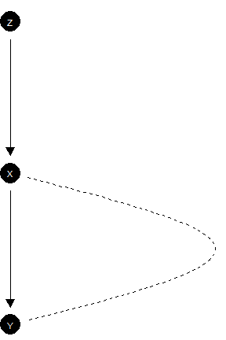

---
title: "Replication code for 'Making, Updating, and Querying Causal Models using CausalQueries'"
date: July 2025
author: Till Tietz, Lily Medina, Georgiy Syunyaev, and Macartan Humphreys
---

Generated by `knitr::spin()` from `code.R`.

Note: final section of code for microbenchmarking is slow
## Set up


``` r
data("lipids_data")
lipids_data
```


# Motivating example


``` r
lipids_model <-  make_model("Z -> X -> Y; X <-> Y") 
```

``` r
lipids_model <- update_model(lipids_model, lipids_data)
```

``` r
lipids_queries <- query_model(lipids_model, queries = list(
  ATE = "Y[X = 1] - Y[X = 0]",
  PoC = "Y[X = 1] - Y[X = 0] :|: X == 0 & Y == 0",
  LATE = "Y[X = 1] - Y[X = 0] :|: X[Z = 1] > X[Z = 0]"),
  using = "posteriors")
```
<table class=" lightable-classic-2" style='font-family: "Arial Narrow", "Source Sans Pro", sans-serif; margin-left: auto; margin-right: auto;'>
 <thead>
  <tr>
   <th style="text-align:center;"> label </th>
   <th style="text-align:center;"> query </th>
   <th style="text-align:center;"> given </th>
   <th style="text-align:center;"> mean </th>
   <th style="text-align:center;"> sd </th>
   <th style="text-align:center;"> cred.low </th>
   <th style="text-align:center;"> cred.high </th>
  </tr>
 </thead>
<tbody>
  <tr>
   <td style="text-align:center;"> ATE </td>
   <td style="text-align:center;"> Y[X = 1] - Y[X = 0] </td>
   <td style="text-align:center;"> - </td>
   <td style="text-align:center;"> 0.55 </td>
   <td style="text-align:center;"> 0.10 </td>
   <td style="text-align:center;"> 0.37 </td>
   <td style="text-align:center;"> 0.73 </td>
  </tr>
  <tr>
   <td style="text-align:center;"> PoC </td>
   <td style="text-align:center;"> Y[X = 1] - Y[X = 0] </td>
   <td style="text-align:center;"> X == 0 &amp; Y == 0 </td>
   <td style="text-align:center;"> 0.63 </td>
   <td style="text-align:center;"> 0.15 </td>
   <td style="text-align:center;"> 0.38 </td>
   <td style="text-align:center;"> 0.89 </td>
  </tr>
  <tr>
   <td style="text-align:center;"> LATE </td>
   <td style="text-align:center;"> Y[X = 1] - Y[X = 0] </td>
   <td style="text-align:center;"> X[Z = 1] &gt; X[Z = 0] </td>
   <td style="text-align:center;"> 0.70 </td>
   <td style="text-align:center;"> 0.05 </td>
   <td style="text-align:center;"> 0.59 </td>
   <td style="text-align:center;"> 0.80 </td>
  </tr>
</tbody>
</table>

``` r
lipids_queries |> plot()
```


``` r
make_model("Z -> X -> Y; X <-> Y") |> update_model(lipids_data) |>
  query_model(queries = list(ATE = "Y[X = 1] - Y[X = 0]",
  PoC  = "Y[X = 1] - Y[X = 0] :|: X == 0 & Y == 0",
  LATE = "Y[X = 1] - Y[X = 0] :|: X[Z = 1] > X[Z = 0]"),
  using = "posteriors") |> plot()
```


<table class=" lightable-classic-2" style='font-family: "Arial Narrow", "Source Sans Pro", sans-serif; margin-left: auto; margin-right: auto;'>
 <thead>
  <tr>
   <th style="text-align:center;"> node </th>
   <th style="text-align:center;"> nodal_type </th>
   <th style="text-align:center;"> param_set </th>
   <th style="text-align:center;"> param_names </th>
   <th style="text-align:center;"> param_value </th>
   <th style="text-align:center;"> priors </th>
  </tr>
 </thead>
<tbody>
  <tr>
   <td style="text-align:center;"> Z </td>
   <td style="text-align:center;"> 0 </td>
   <td style="text-align:center;"> Z </td>
   <td style="text-align:center;"> Z.0 </td>
   <td style="text-align:center;"> 0.84 </td>
   <td style="text-align:center;"> 1 </td>
  </tr>
  <tr>
   <td style="text-align:center;"> Z </td>
   <td style="text-align:center;"> 1 </td>
   <td style="text-align:center;"> Z </td>
   <td style="text-align:center;"> Z.1 </td>
   <td style="text-align:center;"> 0.16 </td>
   <td style="text-align:center;"> 1 </td>
  </tr>
  <tr>
   <td style="text-align:center;"> X </td>
   <td style="text-align:center;"> 00 </td>
   <td style="text-align:center;"> X </td>
   <td style="text-align:center;"> X.00 </td>
   <td style="text-align:center;"> 0.12 </td>
   <td style="text-align:center;"> 1 </td>
  </tr>
  <tr>
   <td style="text-align:center;"> X </td>
   <td style="text-align:center;"> 10 </td>
   <td style="text-align:center;"> X </td>
   <td style="text-align:center;"> X.10 </td>
   <td style="text-align:center;"> 0.08 </td>
   <td style="text-align:center;"> 1 </td>
  </tr>
  <tr>
   <td style="text-align:center;"> X </td>
   <td style="text-align:center;"> 01 </td>
   <td style="text-align:center;"> X </td>
   <td style="text-align:center;"> X.01 </td>
   <td style="text-align:center;"> 0.11 </td>
   <td style="text-align:center;"> 1 </td>
  </tr>
  <tr>
   <td style="text-align:center;"> X </td>
   <td style="text-align:center;"> 11 </td>
   <td style="text-align:center;"> X </td>
   <td style="text-align:center;"> X.11 </td>
   <td style="text-align:center;"> 0.69 </td>
   <td style="text-align:center;"> 1 </td>
  </tr>
  <tr>
   <td style="text-align:center;"> Y </td>
   <td style="text-align:center;"> 00 </td>
   <td style="text-align:center;"> Y.X.00 </td>
   <td style="text-align:center;"> Y.00_X.00 </td>
   <td style="text-align:center;"> 0.38 </td>
   <td style="text-align:center;"> 1 </td>
  </tr>
  <tr>
   <td style="text-align:center;"> Y </td>
   <td style="text-align:center;"> 10 </td>
   <td style="text-align:center;"> Y.X.00 </td>
   <td style="text-align:center;"> Y.10_X.00 </td>
   <td style="text-align:center;"> 0.00 </td>
   <td style="text-align:center;"> 1 </td>
  </tr>
  <tr>
   <td style="text-align:center;"> Y </td>
   <td style="text-align:center;"> 01 </td>
   <td style="text-align:center;"> Y.X.00 </td>
   <td style="text-align:center;"> Y.01_X.00 </td>
   <td style="text-align:center;"> 0.20 </td>
   <td style="text-align:center;"> 1 </td>
  </tr>
  <tr>
   <td style="text-align:center;"> Y </td>
   <td style="text-align:center;"> 11 </td>
   <td style="text-align:center;"> Y.X.00 </td>
   <td style="text-align:center;"> Y.11_X.00 </td>
   <td style="text-align:center;"> 0.42 </td>
   <td style="text-align:center;"> 1 </td>
  </tr>
  <tr>
   <td style="text-align:center;"> Y </td>
   <td style="text-align:center;"> 00 </td>
   <td style="text-align:center;"> Y.X.01 </td>
   <td style="text-align:center;"> Y.00_X.01 </td>
   <td style="text-align:center;"> 0.40 </td>
   <td style="text-align:center;"> 1 </td>
  </tr>
  <tr>
   <td style="text-align:center;"> Y </td>
   <td style="text-align:center;"> 10 </td>
   <td style="text-align:center;"> Y.X.01 </td>
   <td style="text-align:center;"> Y.10_X.01 </td>
   <td style="text-align:center;"> 0.38 </td>
   <td style="text-align:center;"> 1 </td>
  </tr>
  <tr>
   <td style="text-align:center;"> Y </td>
   <td style="text-align:center;"> 01 </td>
   <td style="text-align:center;"> Y.X.01 </td>
   <td style="text-align:center;"> Y.01_X.01 </td>
   <td style="text-align:center;"> 0.06 </td>
   <td style="text-align:center;"> 1 </td>
  </tr>
  <tr>
   <td style="text-align:center;"> Y </td>
   <td style="text-align:center;"> 11 </td>
   <td style="text-align:center;"> Y.X.01 </td>
   <td style="text-align:center;"> Y.11_X.01 </td>
   <td style="text-align:center;"> 0.16 </td>
   <td style="text-align:center;"> 1 </td>
  </tr>
  <tr>
   <td style="text-align:center;"> Y </td>
   <td style="text-align:center;"> 00 </td>
   <td style="text-align:center;"> Y.X.10 </td>
   <td style="text-align:center;"> Y.00_X.10 </td>
   <td style="text-align:center;"> 0.71 </td>
   <td style="text-align:center;"> 1 </td>
  </tr>
  <tr>
   <td style="text-align:center;"> Y </td>
   <td style="text-align:center;"> 10 </td>
   <td style="text-align:center;"> Y.X.10 </td>
   <td style="text-align:center;"> Y.10_X.10 </td>
   <td style="text-align:center;"> 0.15 </td>
   <td style="text-align:center;"> 1 </td>
  </tr>
  <tr>
   <td style="text-align:center;"> Y </td>
   <td style="text-align:center;"> 01 </td>
   <td style="text-align:center;"> Y.X.10 </td>
   <td style="text-align:center;"> Y.01_X.10 </td>
   <td style="text-align:center;"> 0.05 </td>
   <td style="text-align:center;"> 1 </td>
  </tr>
  <tr>
   <td style="text-align:center;"> Y </td>
   <td style="text-align:center;"> 11 </td>
   <td style="text-align:center;"> Y.X.10 </td>
   <td style="text-align:center;"> Y.11_X.10 </td>
   <td style="text-align:center;"> 0.09 </td>
   <td style="text-align:center;"> 1 </td>
  </tr>
  <tr>
   <td style="text-align:center;"> Y </td>
   <td style="text-align:center;"> 00 </td>
   <td style="text-align:center;"> Y.X.11 </td>
   <td style="text-align:center;"> Y.00_X.11 </td>
   <td style="text-align:center;"> 0.65 </td>
   <td style="text-align:center;"> 1 </td>
  </tr>
  <tr>
   <td style="text-align:center;"> Y </td>
   <td style="text-align:center;"> 10 </td>
   <td style="text-align:center;"> Y.X.11 </td>
   <td style="text-align:center;"> Y.10_X.11 </td>
   <td style="text-align:center;"> 0.04 </td>
   <td style="text-align:center;"> 1 </td>
  </tr>
  <tr>
   <td style="text-align:center;"> Y </td>
   <td style="text-align:center;"> 01 </td>
   <td style="text-align:center;"> Y.X.11 </td>
   <td style="text-align:center;"> Y.01_X.11 </td>
   <td style="text-align:center;"> 0.01 </td>
   <td style="text-align:center;"> 1 </td>
  </tr>
  <tr>
   <td style="text-align:center;"> Y </td>
   <td style="text-align:center;"> 11 </td>
   <td style="text-align:center;"> Y.X.11 </td>
   <td style="text-align:center;"> Y.11_X.11 </td>
   <td style="text-align:center;"> 0.30 </td>
   <td style="text-align:center;"> 1 </td>
  </tr>
</tbody>
</table>


# Making models


``` r
model <- make_model("X -> M -> Y <- X")
```
<div class="figure">

<p class="caption">Examples of model graphs.</p>
</div>


## Tailoring models

<table class=" lightable-classic-2" style='font-family: "Arial Narrow", "Source Sans Pro", sans-serif; margin-left: auto; margin-right: auto;'>
 <thead>
  <tr>
   <th style="text-align:left;"> Model </th>
   <th style="text-align:center;"> Degrees of freedom </th>
  </tr>
 </thead>
<tbody>
  <tr>
   <td style="text-align:left;"> X → Y ← W </td>
   <td style="text-align:center;"> 17 </td>
  </tr>
  <tr>
   <td style="text-align:left;"> X → Y ← W; X ↔ W </td>
   <td style="text-align:center;"> 18 </td>
  </tr>
  <tr>
   <td style="text-align:left;"> X → Y ← W; X ↔ Y; W ←→ Y </td>
   <td style="text-align:center;"> 62 </td>
  </tr>
  <tr>
   <td style="text-align:left;"> X → Y ← W; X ↔ Y; W ←→ Y; X ←→ W </td>
   <td style="text-align:center;"> 63 </td>
  </tr>
  <tr>
   <td style="text-align:left;"> X → W → Y ← X </td>
   <td style="text-align:center;"> 19 </td>
  </tr>
  <tr>
   <td style="text-align:left;"> X → W → Y ← X; W ←→ Y </td>
   <td style="text-align:center;"> 64 </td>
  </tr>
  <tr>
   <td style="text-align:left;"> X → W → Y ← X; X ←→ W; W ←→ Y </td>
   <td style="text-align:center;"> 67 </td>
  </tr>
  <tr>
   <td style="text-align:left;"> X → W → Y ← X; X ←→ W; W ←→ Y; X ←→ Y </td>
   <td style="text-align:center;"> 127 </td>
  </tr>
</tbody>
</table>

``` r
model_restricted <- lipids_model |> set_restrictions("X[Z = 1] < X[Z = 0]")
```

``` r
model <- lipids_model |> set_restrictions(
  labels = list(X = "01", Y = c("00", "01", "11")), keep = TRUE)
```

``` r
model <- lipids_model |> set_restrictions(labels = list(Y = "?0"))
```

``` r
model <- lipids_model |> set_restrictions(
  labels = list(Y = c('00', '11')), given = 'X.00')
```

``` r
lipids_model |> inspect("prior_hyperparameters", nodes = "X") 
```

```
## 
## prior_hyperparameters
## Alpha parameter values used for Dirichlet prior distributions:
## 
## X.00 X.10 X.01 X.11 
##    1    1    1    1
```

``` r
model <- lipids_model |> set_priors(distribution = "jeffreys")
```

```
## Altering all parameters.
```

``` r
lipids_model |> set_priors(param_names = c("X.10", "X.01"), alphas = 3:4) |> 
  inspect("prior_hyperparameters", nodes = "X")
```

```
## 
## prior_hyperparameters
## Alpha parameter values used for Dirichlet prior distributions:
## 
## X.00 X.10 X.01 X.11 
##    1    3    4    1
```

``` r
lipids_model |> set_priors(
  statement = "X[Z = 1] > X[Z = 0]", alphas = 3) |>
  inspect("prior_hyperparameters", nodes = "X")
```

```
## 
## prior_hyperparameters
## Alpha parameter values used for Dirichlet prior distributions:
## 
## X.00 X.10 X.01 X.11 
##    1    1    3    1
```

``` r
query <- make_model("X -> Y") |> set_restrictions(decreasing("X", "Y")) |>
  query_model("Y[X = 1] - Y[X = 0]", using = "priors")
```

``` r
make_model("X -> Y") |> inspect("parameters")
```

```
## 
## parameters
## Model parameters with associated probabilities: 
## 
##  X.0  X.1 Y.00 Y.10 Y.01 Y.11 
## 0.50 0.50 0.25 0.25 0.25 0.25
```

``` r
make_model("X -> Y") |> set_parameters(
  statement = "Y[X = 1] > Y[X = 0]", parameters = .7) |>
  inspect("parameters")
```

```
## 
## parameters
## Model parameters with associated probabilities: 
## 
##  X.0  X.1 Y.00 Y.10 Y.01 Y.11 
##  0.5  0.5  0.1  0.1  0.7  0.1
```


## Drawing data


``` r
lipids_model |> make_data(n = 4)
```

``` r
sample_data <- lipids_model |> make_data(
  n = 8, nodes = list(c("Z", "Y"), "X"), probs = list(1, .5),
  subsets = list(TRUE, "Z == 1 & Y == 0"))
```

``` r
sample_data |> collapse_data(lipids_model)
```


# Updating models


``` r
make_model("X -> Y") |> inspect("parameter_mapping") 
```

```
## 
## parameter_mapping (Parameter mapping matrix) 
## 
##   Maps from parameters to data types, with
##   possibly multiple columns for each data type
##   in cases with confounding. 
## 
##      X0Y0 X1Y0 X0Y1 X1Y1
## X.0     1    0    1    0
## X.1     0    1    0    1
## Y.00    1    1    0    0
## Y.10    0    1    1    0
## Y.01    1    0    0    1
## Y.11    0    0    1    1
```

``` r
data <- data.frame(X = rep(0:1, 5), Y = rep(0:1, 5))
list(uncensored = update_model(make_model("X -> Y"), data),
  censored = update_model(make_model("X -> Y"), data, 
    censored_types = c("X1Y0",  "X0Y1"))) |>
  query_model("Y[X = 1] - Y[X = 0]", using = "posteriors") |>
select(-using)
```

```
## 
## Causal queries generated by query_model
```

``` r
model <- make_model("X -> Y") |> update_model()
```

```
## No data provided
```

``` r
posterior <- inspect(model, "posterior_distribution")  
```

```
## 
## posterior_distribution
## Summary statistics of model parameters posterior distributions:
## 
##   Distributions matrix dimensions are 
##   4000 rows (draws) by 6 cols (parameters)
## 
##      mean   sd
## X.0  0.51 0.28
## X.1  0.49 0.28
## Y.00 0.25 0.19
## Y.10 0.25 0.19
## Y.01 0.25 0.19
## Y.11 0.25 0.20
```

``` r
lipids_model <- lipids_model |> update_model(
  keep_fit = TRUE, keep_event_probabilities = TRUE)
```

```
## No data provided
```

``` r
make_model("X -> Y") |> update_model(keep_type_distribution = FALSE) |>
  inspect("stan_summary") 
```

```
## No data provided
```

```
## 
## stan_summary
## Stan model summary:
## 
## Inference for Stan model: simplexes.
## 4 chains, each with iter=2000; warmup=1000; thin=1; 
## post-warmup draws per chain=1000, total post-warmup draws=4000.
## 
##                    mean se_mean   sd   2.5%   25%   50%   75% 97.5% n_eff Rhat
## X.0                0.50    0.01 0.29   0.03  0.25  0.49  0.74  0.97  3036 1.00
## X.1                0.50    0.01 0.29   0.03  0.26  0.51  0.75  0.97  3036 1.00
## Y.00               0.25    0.00 0.19   0.01  0.09  0.21  0.37  0.70  2031 1.00
## Y.10               0.25    0.00 0.19   0.01  0.09  0.21  0.37  0.71  4633 1.00
## Y.01               0.25    0.00 0.20   0.01  0.09  0.20  0.37  0.72  4162 1.00
## Y.11               0.25    0.00 0.20   0.01  0.09  0.20  0.37  0.71  4701 1.00
## lp__               1.00    0.02 0.96   0.03  0.30  0.72  1.39  3.43  2536 1.00
## log_sum_gammas[2]  1.85    0.03 1.19   0.36  1.00  1.58  2.41  4.93  1159 1.01
## lp__              -7.53    0.04 1.65 -11.75 -8.37 -7.15 -6.32 -5.44  1368 1.00
## 
## Samples were drawn using NUTS(diag_e) at Tue Jul 22 00:07:45 2025.
## For each parameter, n_eff is a crude measure of effective sample size,
## and Rhat is the potential scale reduction factor on split chains (at 
## convergence, Rhat=1).
```

``` r
model <- make_model("X -> M -> Y") |> update_model(
  data = data.frame(X = rep(0:1, 10000), Y = rep(0:1, 10000)), 
  iter = 5000, refresh = 0)
```

``` r
model
```

```
## 
## Causal statement: 
## M -> Y; X -> M
## 
## Number of nodal types by node:
## X M Y 
## 2 4 4 
## 
## Number of causal types: 32
## 
## Model has been updated and contains a posterior distribution with
## 4 chains, each with iter=5000; warmup=2500; thin=1;  
## Use inspect(model, 'stan_summary') to inspect stan summary
## 
## Warnings passed from rstan during updating:
## The largest R-hat is 1.73, indicating chains have not mixed
## Bulk Effective Samples Size (ESS) is too low
## Tail Effective Samples Size (ESS) is too low
```

``` r
model <- make_model("X -> Y") |> 
  update_model(refresh = 0, keep_fit = TRUE)
```

```
## No data provided
```

``` r
model |> inspect("stanfit")
```

```
## 
## stanfit
## Stan model summary:
## Inference for Stan model: simplexes.
## 4 chains, each with iter=2000; warmup=1000; thin=1; 
## post-warmup draws per chain=1000, total post-warmup draws=4000.
## 
##                    mean se_mean   sd   2.5%   25%   50%   75% 97.5% n_eff Rhat
## lambdas[1]         0.50    0.01 0.29   0.03  0.25  0.50  0.75  0.97  2558    1
## lambdas[2]         0.50    0.01 0.29   0.03  0.25  0.50  0.75  0.97  2558    1
## lambdas[3]         0.25    0.00 0.20   0.01  0.09  0.20  0.37  0.71  2012    1
## lambdas[4]         0.26    0.00 0.20   0.01  0.10  0.21  0.38  0.72  4663    1
## lambdas[5]         0.25    0.00 0.20   0.01  0.08  0.20  0.37  0.71  4851    1
## lambdas[6]         0.25    0.00 0.19   0.01  0.09  0.20  0.36  0.71  4266    1
## log_sum_gammas[1]  0.99    0.02 0.99   0.03  0.28  0.69  1.37  3.68  2209    1
## log_sum_gammas[2]  1.87    0.03 1.21   0.34  0.99  1.61  2.45  5.02  1315    1
## types[1]           0.13    0.00 0.14   0.00  0.03  0.08  0.18  0.49  2317    1
## types[2]           0.12    0.00 0.13   0.00  0.02  0.07  0.18  0.49  2150    1
## types[3]           0.13    0.00 0.14   0.00  0.03  0.08  0.18  0.51  3350    1
## types[4]           0.13    0.00 0.13   0.00  0.03  0.08  0.18  0.50  3460    1
## types[5]           0.12    0.00 0.13   0.00  0.03  0.08  0.18  0.49  3676    1
## types[6]           0.12    0.00 0.14   0.00  0.02  0.08  0.18  0.51  3694    1
## types[7]           0.12    0.00 0.13   0.00  0.03  0.08  0.18  0.47  3424    1
## types[8]           0.12    0.00 0.13   0.00  0.03  0.08  0.18  0.49  3166    1
## lp__              -7.55    0.05 1.66 -11.87 -8.39 -7.15 -6.33 -5.45  1357    1
## 
## Samples were drawn using NUTS(diag_e) at Tue Jul 22 00:08:05 2025.
## For each parameter, n_eff is a crude measure of effective sample size,
## and Rhat is the potential scale reduction factor on split chains (at 
## convergence, Rhat=1).
```


# Querying models


``` r
make_model("X -> Y") |> realise_outcomes()
```

``` r
make_model("X -> Y") |> realise_outcomes(dos = list(X = 1))
```

``` r
make_model("X -> Y")  |> get_query_types("Y == 1")
```

```
## 
## Causal types satisfying query's condition(s)  
## 
##  query =  Y==1 
## 
## X0.Y10  X1.Y01
## X0.Y11  X1.Y11
## 
## 
##  Number of causal types that meet condition(s) =  4
##  Total number of causal types in model =  8
```

``` r
make_model("X -> Y") |> get_query_types("Y[X = 0] == 1")
```

```
## 
## Causal types satisfying query's condition(s)  
## 
##  query =  Y[X=0]==1 
## 
## X0.Y10  X1.Y10
## X0.Y11  X1.Y11
## 
## 
##  Number of causal types that meet condition(s) =  4
##  Total number of causal types in model =  8
```

``` r
make_model("X1 -> Y <- X2")  |> get_query_types(
  "X1 == 1 & X2 == 1 & (Y[X1 = 1, X2 = 1] > Y[X1 = 0, X2 = 0])")
```

```
## 
## Causal types satisfying query's condition(s)  
## 
##  query =  X1==1&X2==1&(Y[X1=1,X2=1]>Y[X1=0,X2=0]) 
## 
## X11.X21.Y0001  X11.X21.Y0101
## X11.X21.Y0011  X11.X21.Y0111
## 
## 
##  Number of causal types that meet condition(s) =  4
##  Total number of causal types in model =  64
```

``` r
make_model("X -> Y") |> get_query_types("Y[X = 1] - Y[X = 0]")
```

```
## X0.Y00 X1.Y00 X0.Y10 X1.Y10 X0.Y01 X1.Y01 X0.Y11 X1.Y11 
##      0      0     -1     -1      1      1      0      0
```

``` r
data  <- data.frame(X = rep(0:1, 50), Y = rep(0:1, 50))

model <-  make_model("X -> Y") |> update_model(
  data, iter = 4000, refresh = 0)

model |> grab("posterior_distribution")  |> 
  ggplot(aes(Y.01 - Y.10)) + geom_histogram() 
```

```
## `stat_bin()` using `bins = 30`. Pick better value with `binwidth`.
```

<div class="figure" style="text-align: center">

<p class="caption">Posterior on "Probability $Y$ is increasing in $X$".</p>
</div>

``` r
queries <- make_model("X -> Y") |> query_distribution(
  query = list(increasing = "(Y[X = 1] > Y[X = 0])", 
    ATE = "(Y[X = 1] - Y[X = 0])"), using = "priors")
```

``` r
lipids_model |> query_model(
    query = "Y[X = 1] - Y[X = 0] :|: X == 1 & Y == 1 & Z == 1",
    using = "posteriors") |> plot()
```


``` r
make_model("X -> M -> Y") |> update_model(
  data.frame(X = rep(0:1, 8), Y = rep(0:1, 8)), iter = 4000) |>
  query_model("Y[X = 1] > Y[X = 0] :|: X == 1 & Y == 1 & M == 1", 
  using = "posteriors", case_level = c(TRUE, FALSE)) |>
  plot()
```


``` r
models <- list(
  Unrestricted = lipids_model |> 
    update_model(data = lipids_data, refresh = 0),
  Restricted = lipids_model |> set_restrictions("X[Z = 1] < X[Z = 0]") |> 
    update_model(data = lipids_data, refresh = 0)
)
```

``` r
queries <- query_model(models, query = 
  list(ATE = "Y[X=1] - Y[X=0]", 
    POS = "Y[X=1] > Y[X=0] :|: Y==1 & X==1"),
  case_level = c(FALSE, TRUE), using = c("priors", "posteriors"),
  expand_grid = TRUE)
```
<table class=" lightable-classic-2" style='font-family: "Arial Narrow", "Source Sans Pro", sans-serif; margin-left: auto; margin-right: auto;'>
 <thead>
  <tr>
   <th style="text-align:center;"> label </th>
   <th style="text-align:center;"> model </th>
   <th style="text-align:center;"> query </th>
   <th style="text-align:center;"> given </th>
   <th style="text-align:center;"> using </th>
   <th style="text-align:center;"> case_level </th>
   <th style="text-align:center;"> mean </th>
  </tr>
 </thead>
<tbody>
  <tr>
   <td style="text-align:center;"> ATE </td>
   <td style="text-align:center;"> Unrestricted </td>
   <td style="text-align:center;"> Y[X=1] - Y[X=0] </td>
   <td style="text-align:center;"> - </td>
   <td style="text-align:center;"> priors </td>
   <td style="text-align:center;"> FALSE </td>
   <td style="text-align:center;"> 0.00 </td>
  </tr>
  <tr>
   <td style="text-align:center;"> ATE </td>
   <td style="text-align:center;"> Restricted </td>
   <td style="text-align:center;"> Y[X=1] - Y[X=0] </td>
   <td style="text-align:center;"> - </td>
   <td style="text-align:center;"> priors </td>
   <td style="text-align:center;"> FALSE </td>
   <td style="text-align:center;"> 0.00 </td>
  </tr>
  <tr>
   <td style="text-align:center;"> ATE </td>
   <td style="text-align:center;"> Unrestricted </td>
   <td style="text-align:center;"> Y[X=1] - Y[X=0] </td>
   <td style="text-align:center;"> - </td>
   <td style="text-align:center;"> posteriors </td>
   <td style="text-align:center;"> FALSE </td>
   <td style="text-align:center;"> 0.56 </td>
  </tr>
  <tr>
   <td style="text-align:center;"> ATE </td>
   <td style="text-align:center;"> Restricted </td>
   <td style="text-align:center;"> Y[X=1] - Y[X=0] </td>
   <td style="text-align:center;"> - </td>
   <td style="text-align:center;"> posteriors </td>
   <td style="text-align:center;"> FALSE </td>
   <td style="text-align:center;"> 0.56 </td>
  </tr>
  <tr>
   <td style="text-align:center;"> POS </td>
   <td style="text-align:center;"> Unrestricted </td>
   <td style="text-align:center;"> Y[X=1] &gt; Y[X=0] </td>
   <td style="text-align:center;"> Y==1 &amp; X==1 </td>
   <td style="text-align:center;"> priors </td>
   <td style="text-align:center;"> FALSE </td>
   <td style="text-align:center;"> 0.50 </td>
  </tr>
  <tr>
   <td style="text-align:center;"> POS </td>
   <td style="text-align:center;"> Restricted </td>
   <td style="text-align:center;"> Y[X=1] &gt; Y[X=0] </td>
   <td style="text-align:center;"> Y==1 &amp; X==1 </td>
   <td style="text-align:center;"> priors </td>
   <td style="text-align:center;"> FALSE </td>
   <td style="text-align:center;"> 0.49 </td>
  </tr>
  <tr>
   <td style="text-align:center;"> POS </td>
   <td style="text-align:center;"> Unrestricted </td>
   <td style="text-align:center;"> Y[X=1] &gt; Y[X=0] </td>
   <td style="text-align:center;"> Y==1 &amp; X==1 </td>
   <td style="text-align:center;"> posteriors </td>
   <td style="text-align:center;"> FALSE </td>
   <td style="text-align:center;"> 0.95 </td>
  </tr>
  <tr>
   <td style="text-align:center;"> POS </td>
   <td style="text-align:center;"> Restricted </td>
   <td style="text-align:center;"> Y[X=1] &gt; Y[X=0] </td>
   <td style="text-align:center;"> Y==1 &amp; X==1 </td>
   <td style="text-align:center;"> posteriors </td>
   <td style="text-align:center;"> FALSE </td>
   <td style="text-align:center;"> 0.95 </td>
  </tr>
  <tr>
   <td style="text-align:center;"> ATE </td>
   <td style="text-align:center;"> Unrestricted </td>
   <td style="text-align:center;"> Y[X=1] - Y[X=0] </td>
   <td style="text-align:center;"> - </td>
   <td style="text-align:center;"> priors </td>
   <td style="text-align:center;"> TRUE </td>
   <td style="text-align:center;"> 0.00 </td>
  </tr>
  <tr>
   <td style="text-align:center;"> ATE </td>
   <td style="text-align:center;"> Restricted </td>
   <td style="text-align:center;"> Y[X=1] - Y[X=0] </td>
   <td style="text-align:center;"> - </td>
   <td style="text-align:center;"> priors </td>
   <td style="text-align:center;"> TRUE </td>
   <td style="text-align:center;"> 0.00 </td>
  </tr>
  <tr>
   <td style="text-align:center;"> ATE </td>
   <td style="text-align:center;"> Unrestricted </td>
   <td style="text-align:center;"> Y[X=1] - Y[X=0] </td>
   <td style="text-align:center;"> - </td>
   <td style="text-align:center;"> posteriors </td>
   <td style="text-align:center;"> TRUE </td>
   <td style="text-align:center;"> 0.56 </td>
  </tr>
  <tr>
   <td style="text-align:center;"> ATE </td>
   <td style="text-align:center;"> Restricted </td>
   <td style="text-align:center;"> Y[X=1] - Y[X=0] </td>
   <td style="text-align:center;"> - </td>
   <td style="text-align:center;"> posteriors </td>
   <td style="text-align:center;"> TRUE </td>
   <td style="text-align:center;"> 0.56 </td>
  </tr>
  <tr>
   <td style="text-align:center;"> POS </td>
   <td style="text-align:center;"> Unrestricted </td>
   <td style="text-align:center;"> Y[X=1] &gt; Y[X=0] </td>
   <td style="text-align:center;"> Y==1 &amp; X==1 </td>
   <td style="text-align:center;"> priors </td>
   <td style="text-align:center;"> TRUE </td>
   <td style="text-align:center;"> 0.50 </td>
  </tr>
  <tr>
   <td style="text-align:center;"> POS </td>
   <td style="text-align:center;"> Restricted </td>
   <td style="text-align:center;"> Y[X=1] &gt; Y[X=0] </td>
   <td style="text-align:center;"> Y==1 &amp; X==1 </td>
   <td style="text-align:center;"> priors </td>
   <td style="text-align:center;"> TRUE </td>
   <td style="text-align:center;"> 0.49 </td>
  </tr>
  <tr>
   <td style="text-align:center;"> POS </td>
   <td style="text-align:center;"> Unrestricted </td>
   <td style="text-align:center;"> Y[X=1] &gt; Y[X=0] </td>
   <td style="text-align:center;"> Y==1 &amp; X==1 </td>
   <td style="text-align:center;"> posteriors </td>
   <td style="text-align:center;"> TRUE </td>
   <td style="text-align:center;"> 0.95 </td>
  </tr>
  <tr>
   <td style="text-align:center;"> POS </td>
   <td style="text-align:center;"> Restricted </td>
   <td style="text-align:center;"> Y[X=1] &gt; Y[X=0] </td>
   <td style="text-align:center;"> Y==1 &amp; X==1 </td>
   <td style="text-align:center;"> posteriors </td>
   <td style="text-align:center;"> TRUE </td>
   <td style="text-align:center;"> 0.95 </td>
  </tr>
</tbody>
</table>


default plot associated with this query:


# Appendix


## illustrative code for parallelization


``` r
library("parallel")
options(mc.cores = parallel::detectCores())
```

``` r
library("future")
library("future.apply")

chains <- 3
cores <- 8

future::plan(list(
  future::tweak(future::multisession, 
    workers = floor(cores/(chains + 1))),
  future::tweak(future::multisession, workers = chains)))

model <- make_model("X -> Y")

data <- list(data_1 = data.frame(X = 0:1, Y = 0:1), 
  data_2 = data.frame(X = 0:1, Y = 1:0))

results <- future.apply::future_lapply(data, function(d) {
  update_model(model = model, data = d, chains = chains, refresh = 0)},
 future.seed = TRUE)
```


## stan code


```
S4 class stanmodel 'simplexes' coded as follows:
functions {
  row_vector col_sums(matrix X) {
    row_vector[cols(X)] s;
    s = rep_row_vector(1, rows(X)) * X;
    return s;
  }
}
data {
  int<lower=1> n_params;
  int<lower=1> n_paths;
  int<lower=1> n_types;
  int<lower=1> n_param_sets;
  int<lower=1> n_nodes;
  array[n_param_sets] int<lower=1> n_param_each;
  int<lower=1> n_data;
  int<lower=1> n_events;
  int<lower=1> n_strategies;
  int<lower=0, upper=1> keep_type_distribution;
  vector<lower=0>[n_params] lambdas_prior;
  array[n_param_sets] int<lower=1> l_starts;
  array[n_param_sets] int<lower=1> l_ends;
  array[n_nodes] int<lower=1> node_starts;
  array[n_nodes] int<lower=1> node_ends;
  array[n_strategies] int<lower=1> strategy_starts;
  array[n_strategies] int<lower=1> strategy_ends;
  matrix[n_params, n_types] P;
  matrix[n_params, n_paths] parmap;
  matrix[n_paths, n_data] map;
  matrix<lower=0, upper=1>[n_events, n_data] E;
  array[n_events] int<lower=0> Y;
}
parameters {
  vector<lower=0>[n_params - n_param_sets] gamma;
}
transformed parameters {
  vector<lower=0, upper=1>[n_params] lambdas;
  vector<lower=1>[n_param_sets] sum_gammas;
  matrix[n_params, n_paths] parlam;
  matrix[n_nodes, n_paths] parlam2;
  vector<lower=0, upper=1>[n_paths] w_0;
  vector<lower=0, upper=1>[n_data] w;
  vector<lower=0, upper=1>[n_events] w_full;
  vector[n_param_sets] log_sum_gammas;
  // Handle cases where parameter set has only one value
  for (i in 1:n_param_sets) {
    if (l_starts[i] >= l_ends[i]) {
      sum_gammas[i] = 1;
      lambdas[l_starts[i]] = 1;
    } else {
      sum_gammas[i] = 1 + sum(gamma[(l_starts[i] - (i - 1)):(l_ends[i] - i)]);
      lambdas[l_starts[i]:l_ends[i]] =
        append_row(1, gamma[(l_starts[i] - (i - 1)):(l_ends[i] - i)]) /
        sum_gammas[i];
    }
  }
  // Mapping from parameters to data types
  parlam = rep_matrix(lambdas, n_paths) .* parmap;
  // Sum probability over nodes on each path
  for (i in 1:n_nodes) {
    parlam2[i, ] = col_sums(parlam[(node_starts[i]):(node_ends[i]), ]);
  }
  // Compute probability of data type on each path
  for (i in 1:n_paths) {
    w_0[i] = exp(sum(log(parlam2[, i])));
  }
  // Map to n_data columns instead of n_paths (if confounding)
  w = map' * w_0;
  // Extend/reduce to cover all observed data types
  w_full = E * w;
  // Calculate log sum gammas once for efficiency
  log_sum_gammas = log(sum_gammas);
}
model {
  // Dirichlet distributions
  for (i in 1:n_param_sets) {
    target += dirichlet_lpdf(lambdas[l_starts[i]:l_ends[i]] |
                             lambdas_prior[l_starts[i]:l_ends[i]]);
    target += -n_param_each[i] * log_sum_gammas[i];
  }
  // Multinomial likelihoods (handling censoring)
  for (i in 1:n_strategies) {
    target += multinomial_lpmf(
      Y[strategy_starts[i]:strategy_ends[i]] |
      w_full[strategy_starts[i]:strategy_ends[i]] /
      sum(w_full[strategy_starts[i]:strategy_ends[i]])
    );
  }
}
// Option to export distribution of causal types
generated quantities {
  vector[n_types] types;
  if (keep_type_distribution == 1) {
    for (i in 1:n_types) {
      types[i] = prod(P[, i] .* lambdas + 1 - P[, i]);
    }
  } else {
    types = rep_vector(1, n_types);
  }
} 
```


## benchmarking (slow)

<table class=" lightable-classic-2" style='font-family: "Arial Narrow", "Source Sans Pro", sans-serif; margin-left: auto; margin-right: auto;'>
 <thead>
  <tr>
   <th style="text-align:center;"> Model </th>
   <th style="text-align:center;"> Number of parameters </th>
   <th style="text-align:center;"> Runtime (seconds) </th>
  </tr>
 </thead>
<tbody>
  <tr>
   <td style="text-align:center;"> X1 → Y </td>
   <td style="text-align:center;"> 6 </td>
   <td style="text-align:center;"> 9.22 </td>
  </tr>
  <tr>
   <td style="text-align:center;"> X1 → Y; X2 → Y </td>
   <td style="text-align:center;"> 20 </td>
   <td style="text-align:center;"> 12.82 </td>
  </tr>
  <tr>
   <td style="text-align:center;"> X1 → Y; X2 → Y; X3 → Y </td>
   <td style="text-align:center;"> 262 </td>
   <td style="text-align:center;"> 100.82 </td>
  </tr>
</tbody>
</table>
<table class=" lightable-classic-2" style='font-family: "Arial Narrow", "Source Sans Pro", sans-serif; margin-left: auto; margin-right: auto;'>
 <thead>
  <tr>
   <th style="text-align:center;"> Model </th>
   <th style="text-align:center;"> Number of observations </th>
   <th style="text-align:center;"> Runtime (seconds) </th>
  </tr>
 </thead>
<tbody>
  <tr>
   <td style="text-align:center;"> X1 → Y </td>
   <td style="text-align:center;"> 10 </td>
   <td style="text-align:center;"> 9.05 </td>
  </tr>
  <tr>
   <td style="text-align:center;"> X1 → Y </td>
   <td style="text-align:center;"> 100 </td>
   <td style="text-align:center;"> 9.40 </td>
  </tr>
  <tr>
   <td style="text-align:center;"> X1 → Y </td>
   <td style="text-align:center;"> 1000 </td>
   <td style="text-align:center;"> 11.73 </td>
  </tr>
  <tr>
   <td style="text-align:center;"> X1 → Y </td>
   <td style="text-align:center;"> 10000 </td>
   <td style="text-align:center;"> 18.39 </td>
  </tr>
</tbody>
</table>

