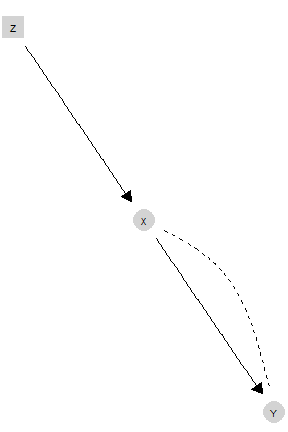
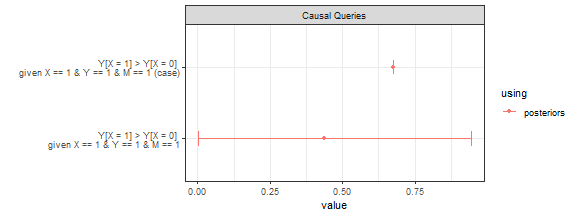

## Introduction: Causal models {#sec-intro}

[CausalQueries]{.pkg} is an [R]{.proglang} package that lets users make, update, and query causal models. Users provide a structural causal model in the form of a statement that reports a set of binary variables and the relations of causal ancestry between them. There are three primary functions. The first, `make_model()`, takes a causal statement and generates a parameter vector that fully describes a probability distribution over all possible types of causal relations between variables ("causal types"). Given a prior distribution over parameters---equivalently, over causal models consistent with the structural model--- and data on some or all nodes, the second primary function, `update_model()`, deploys a Stan [@carpenter_stan_2017] model to generate a posterior distribution over causal models. The third primary function `query_model()` can then be used to ask a wide range of causal queries, using either the prior distribution, the posterior distribution, or a user-specified candidate vector of parameters.

In the next section we provide a motivating example that uses the three primary functions together. We then describe how the package relates to existing available software. @sec-theory gives an overview of the statistical model behind the package. @sec-make, @sec-update, and @sec-query then describe, in turn, the functionality for making, updating, and querying causal models. We provide further computation details in the final section.

## Motivating example


Before providing details on package functionality, we give an example of an application of  the three primary functions, showing how to use [CausalQueries]{.pkg} to replicate the analysis in [@chickering_clinicians_1996; see also @humphreys_integrated_2023]. 

@chickering_clinicians_1996 seek to draw inferences on causal effects in the presence of imperfect compliance. We have access to an instrument $Z$ (a randomly assigned prescription for cholesterol medication), which is a cause of $X$ (treatment uptake) but otherwise unrelated to $Y$ (cholesterol). We imagine we are interested in three specific queries. The first is the average causal effect of $X$ on $Y$. The second is the average effect for units for which $X=0$ and $Y=0$; this "probability of causation" query asks whether untreated individuals with bad outcomes did poorly *because* they were untreated. The last is the average effect for "compliers": units for which $X$ responds positively to $Z$. Thus two of these queries are conditional queries, with one conditional on a counterfactual quantity.

The data on $Z$, $X$, and $Y$ is given in @chickering_clinicians_1996 and is also included in the [CausalQueries]{.pkg} package. The data looks as follows:


``` r
data("lipids_data")
lipids_data
```

```
##    event strategy count
## 1 Z0X0Y0      ZXY   158
## 2 Z1X0Y0      ZXY    52
## 3 Z0X1Y0      ZXY     0
## 4 Z1X1Y0      ZXY    23
## 5 Z0X0Y1      ZXY    14
## 6 Z1X0Y1      ZXY    12
## 7 Z0X1Y1      ZXY     0
## 8 Z1X1Y1      ZXY    78
```

This data is reported in "compact form," meaning it records the number of units ("count") that display each possible pattern of outcomes on $Z$, $X$, and $Y$ ("event"). 


The strategy to analyse this data involves three steps:

* Step 1: generate a model with `make_model`, yielding an object of class `causal_model`,
* Step 2: update the model with `update_model`, again yielding an object of class `causal_model`,
* Step 3: pose queries of the model  with `query_model`, yielding an object of class `model_query`.

Users generate the stipulated causal model using [CausalQueries]{.pkg} as follows:


``` r
lipids_model <-  make_model("Z -> X -> Y; X <-> Y") 
```

The result is an object of class `causal_model`, with associated `print`, `summary`, and `plot` methods. By default, uniform priors are placed on model parameters.

Users can then _update_ beliefs over model parameters by supplying data as follows:


``` r
lipids_model <- update_model(lipids_model, lipids_data)
```

The updated model is also an object of class `causal_model`, though now also containing a posterior distribution over model parameters. 

Finally, users can _query_ the model. For instance, the three previously mentioned queries, which vary in the type of conditioning imposed, can be formulated as follows:


``` r
lipids_queries <- query_model(lipids_model, queries = list(
  ATE = "Y[X = 1] - Y[X = 0]",
  PoC = "Y[X = 1] - Y[X = 0] :|: X == 0 & Y == 0",
  LATE = "Y[X = 1] - Y[X = 0] :|: X[Z = 1] > X[Z = 0]"),
  using = "posteriors")
```

The output is an object of class `model_query`, with associated `print`, `summary`, and `plot` methods.  

The `model_query` object is a data frame containing estimates, and, when available, prior or posterior standard deviations, and credibility intervals. 

@tbl-lipids presents the results from the analysis of the lipids data.^[Note that the "using" column is omitted to simplify output, as all estimands are derived from the posterior distribution.] Rows 1 and 2 in the table replicate the results from @chickering_clinicians_1996, while row 3 provides inferences for the local average treatment effects (LATE).

<table class=" lightable-classic-2" style='color: black; font-family: "Arial Narrow", "Source Sans Pro", sans-serif; margin-left: auto; margin-right: auto;'>
 <thead>
  <tr>
   <th style="text-align:center;"> label </th>
   <th style="text-align:center;"> query </th>
   <th style="text-align:center;"> given </th>
   <th style="text-align:center;"> mean </th>
   <th style="text-align:center;"> sd </th>
   <th style="text-align:center;"> cred.low </th>
   <th style="text-align:center;"> cred.high </th>
  </tr>
 </thead>
<tbody>
  <tr>
   <td style="text-align:center;"> ATE </td>
   <td style="text-align:center;"> Y[X = 1] - Y[X = 0] </td>
   <td style="text-align:center;"> - </td>
   <td style="text-align:center;"> 0.55 </td>
   <td style="text-align:center;"> 0.10 </td>
   <td style="text-align:center;"> 0.37 </td>
   <td style="text-align:center;"> 0.73 </td>
  </tr>
  <tr>
   <td style="text-align:center;"> PoC </td>
   <td style="text-align:center;"> Y[X = 1] - Y[X = 0] </td>
   <td style="text-align:center;"> X == 0 &amp; Y == 0 </td>
   <td style="text-align:center;"> 0.64 </td>
   <td style="text-align:center;"> 0.15 </td>
   <td style="text-align:center;"> 0.37 </td>
   <td style="text-align:center;"> 0.89 </td>
  </tr>
  <tr>
   <td style="text-align:center;"> LATE </td>
   <td style="text-align:center;"> Y[X = 1] - Y[X = 0] </td>
   <td style="text-align:center;"> X[Z = 1] &gt; X[Z = 0] </td>
   <td style="text-align:center;"> 0.70 </td>
   <td style="text-align:center;"> 0.05 </td>
   <td style="text-align:center;"> 0.59 </td>
   <td style="text-align:center;"> 0.80 </td>
  </tr>
</tbody>
</table>

For visual presentation of the results, output can also be plotted:


``` r
lipids_queries |> plot()
```


These core functions can be combined in a single pipeline as follows:


``` r
make_model("Z -> X -> Y; X <-> Y") |> update_model(lipids_data) |>
  query_model(queries = list(ATE = "Y[X = 1] - Y[X = 0]",
  PoC  = "Y[X = 1] - Y[X = 0] :|: X == 0 & Y == 0",
  LATE = "Y[X = 1] - Y[X = 0] :|: X[Z = 1] > X[Z = 0]"),
  using = "posteriors") |> plot()
```

As we describe below, the same basic procedure of making, updating, and querying models, can be used (up to computational constraints) for arbitrary causal models, for different types of data structures, and for all causal queries that can be posed of the causal model.

## Connections to existing packages

The field of causal inference encompasses a wide range of software tools used across various disciplines, including social sciences, natural sciences, computer science, and applied mathematics. This section focuses on the role and capabilities of [CausalQueries]{.pkg} within the specific area of evaluating causal queries on models represented as directed acyclic graphs (DAGs) or structural equation models (SEMs).  @tbl-software provides a summary of relevant software, highlighting their connections, strengths, and limitations in comparison to [CausalQueries]{.pkg}.

:::{#tbl-software tbl-colwidths="\[19,20,10,18,38\]"}
+--------------------+--------------------------+---------------------+--------------+---------------------------------------------------------------------+
| Software           | Source                   | Language            | Availability | Scope                                                               |
+====================+==========================+=====================+==============+=====================================================================+
| [causalnex]{.pkg}  | @beaumont_causalnex_2021 | [Python]{.proglang} | -   pip      | -   causal structure learning                                       |
|                    |                          |                     |              | -   querying marginal distributions                                 |
|                    |                          |                     |              | -   discrete data                                                   |
+--------------------+--------------------------+---------------------+--------------+---------------------------------------------------------------------+
| [pclag]{.pkg}      | @kalisch_causal_2012     | [R]{.proglang}      | -   CRAN     | -   causal structure learning                                       |
|                    |                          |                     | -   GitHub   | -   ATEs under linear conditional expectations, no hidden selection |
+--------------------+--------------------------+---------------------+--------------+---------------------------------------------------------------------+
| [DoWhy]{.pkg}      | @dowhy                   | [Python]{.proglang} | -   pip      | -   identification                                                  |
|                    |                          |                     |              | -   average and conditional causal effects                          |
|                    |                          |                     |              | -   robustness checks                                               |
+--------------------+--------------------------+---------------------+--------------+---------------------------------------------------------------------+
| [autobounds]{.pkg} | @duarte_automated_2023   | [Python]{.proglang} | -   Docker   | -   bounding causal effects                                         |
|                    |                          |                     | -   GitHub   | -   partial identification                                          |
|                    |                          |                     |              | -   DAG canonicalization                                            |
|                    |                          |                     |              | -   binary data                                                     |
+--------------------+--------------------------+---------------------+--------------+---------------------------------------------------------------------+
| [causaloptim]{.pkg}| @sachs_general_2023      | [R]{.proglang}      | -   CRAN     | -   bounding causal effects                                         |
|                    |                          |                     | -   GitHub   | -   non-identified queries                                          |
|                    |                          |                     |              | -   binary data                                                     |
+--------------------+--------------------------+---------------------+--------------+---------------------------------------------------------------------+

Related software.
:::

[causalnex]{.pkg} is comprehensive software that offers functions for discovering and querying causal models. Like [CausalQueries]{.pkg}, it uses Bayesian methods and supports "`do` calculus" [@pearl_causality_2009]. It focuses on conditional probability distribution tables instead of principal strata (causal types). This limits the types of queries and expert information that can be incorporated. For example, knowing conditional probability distributions is not enough to make claims about (or provide priors with respect to) effect monotonicity, complier effects, or the "probability of causation" [@dawid2017probability]. However, it allows for efficient handling of simple queries with larger models.

Similar to [causalnex]{.pkg}, [pclag]{.pkg} emphasizes learning about causal structures and uses the resulting DAGs to recover average treatment effects (ATEs) across all learned Markov-equivalent classes from observed data that satisfy linearity of conditional expectations. This approach is also more restrictive than [CausalQueries]{.pkg} in terms of the queries it allows.

[DoWhy]{.pkg} is a feature-rich framework focusing on causal identification, effect estimation, and assumption validation. With a user-specified DAG, it uses do-calculus to find expressions that identify desired causal effects through Back-door, Front-door, instrumental variable (IV), and mediation criteria, and then uses standard estimators to estimate the desired effect. After estimation, [DoWhy]{.pkg} deploys a comprehensive refutation engine with a large set of robustness tests. While this approach efficiently handles varied data types on large causal models, not parameterizing the DAG itself limits the types of queries that can be posed.

The packages most similar to [CausalQueries]{.pkg} for model definition are [autobounds]{.pkg} and [causaloptim]{.pkg}. They deal with discrete causal models, and their definitions of principal strata (causal types) and causal relations on the DAG are very similar to those of [CausalQueries]{.pkg}. Differences arise in how disturbance terms and confounding are defined: implicitly by the causal statement in [CausalQueries]{.pkg} versus explicitly via separate disturbance nodes in [autobounds]{.pkg} and [causaloptim]{.pkg}. While [CausalQueries]{.pkg} assumes a canonical form for input DAGs, [autobounds]{.pkg} and [causaloptim]{.pkg} facilitate canonicalization. The main difference between the methods is in their approach to evaluating queries.

Both [autobounds]{.pkg} and [causaloptim]{.pkg} build on seminal approaches in @balke_bounds_1997 to construct bounds on queries, using constrained polynomial and linear optimization, respectively. In contrast, [CausalQueries]{.pkg} uses Bayesian inference to generate a posterior over the causal model, which is then queried [consistent with @chickering_clinicians_1996; @zhang_partial_2022]. A key difference is the target of inference. The polynomial and linear programming approach is suited to handling larger causal models. However, due to their similar model parameterization, [autobounds]{.pkg}, [causaloptim]{.pkg}, and [CausalQueries]{.pkg} face similar constraints as parameter spaces expand rapidly with model size. The Bayesian approach to model updating and querying is more efficient because a model can be updated once and queried multiple times, while expensive optimization runs are needed for each separate query in [autobounds]{.pkg} and [causaloptim]{.pkg}.

In summary, the main strength of [CausalQueries]{.pkg} is its ability to let users define an arbitrary DAG and pose any queries on it, using a canonical procedure to form Bayesian posteriors for those queries, regardless of whether they are identified. For instance, if researchers want to learn about the local average treatment effect and their model meets the conditions in @angrist_identification_1996, updating will recover valid estimates as data grows, even if researchers are unaware that the local average treatment effect is identified or unfamiliar with the specific estimation method proposed by @angrist_identification_1996.

There are two main limitations of the models that [CausalQueries]{.pkg} can handle. First, [CausalQueries]{.pkg} is designed for models with a relatively small number of binary nodes. Since it does not limit the range of possible causal relationships in a model, the parameter space expands quickly with the model's complexity. This complexity growth depends on the causal structure and increases rapidly with the number of parents influencing a child node. A chain model like $A \rightarrow B \rightarrow C \rightarrow D \rightarrow E$ has only 18 parameters ($2^1 + 4\times 2^2$), while a model in which $A, B, C, D$ are all direct ancestors of $E$ has $65,544$ parameters ($4\times 2^1 + 2^{(2^4)}$). Switching from binary to nonbinary nodes has similar effects. The restriction to binary nodes is for computational, not conceptual, reasons.^[See Section 9.4.1 of @humphreys_integrated_2023 for a method that represents non-binary data as a profile of outcomes on multiple binary nodes.]

Second, the package is designed for learning about populations from independently sampled units. Therefore, it does not inherently address issues of clustering, hierarchical structures, or purposive sampling. However, the broader framework can be adapted for these purposes [see Section 9.4 of @humphreys_integrated_2023]. The targets of inference are case-level or population-level quantities; [CausalQueries]{.pkg} is not well-suited for estimating sample quantities.

## Statistical model {#sec-theory}


The core conceptual framework used by [CausalQueries]{.pkg} is that described in Pearl's *Causality* [@pearl_causality_2009]. 

The two key steps to defining a causal model are to define a causal structure and then place a probability distribution over the exogeneous variables in the model. 

Relying on ideas in @pearl_causality_2009  [with notation from @humphreys_integrated_2023], we define a causal model as follows:

```{=tex}
\begin{definition}
  
  A ``\textbf{causal model}'' is:
  \begin{enumerate}
    \item an ordered collection of ``endogenous nodes" $Y = \{Y_1, Y_2, \dots, Y_n\}$,
    \item an ordered collection of ``exogenous nodes" $\Theta = \{\theta^{Y_1}, \theta^{Y_2}, \dots, \theta^{Y_n}\}$,
    \item an ordered collection of functions $F = \{f_{Y_1}, f_{Y_2}, \dots, f_{Y_n}\}$ with $f_{Y_j}$ specifying, for each $j$, how outcome $Y_j$ depends on $\theta_j$ and realizations of endogenous nodes prior to $Y_j$,
    \item a probability distribution, $\lambda$, over $\Theta$.
  \end{enumerate}
  
\end{definition}
```


Elements 1-3 define a "**structural causal model**." These components pin down a causal structure,  specifying which endogenous nodes are (possible) direct causes of a node, $Y_j$, given the other nodes in a model. Such nodes are referred to as the "parents" of $Y_j$, denoted as $PA_j$ (where uppercase $PA_j$ represents the collection of nodes, and lowercase $pa_j$ represents a specific set of values these nodes might assume).

Specifying a structural causal model involves making possibly strong assumptions, for example about which nodes are not plausibly causes of other nodes. Even still, without information on the distribution of exogenous nodes, a structural causal model is generally not rich enough to allow us to make probabilistic statements about the distribution of outcomes. Adding the final element of the definition then gives us the fully specified causal model.

With discrete-valued nodes, it is possible to identify all potential responses of a node to its parents,  which we call "nodal types" ("response functions" in @pearl_causality_2009). If a node $i$ can take on $k_i$ possible values, then the set of possible values that the parents of $j$ can assume is $m_j :=\prod_{i\in PA_j}k_i$. Consequently, there are $k_j^{m_j}$ different ways that node $j$ might respond to its parents. For binary nodes, this simplifies to $2^{\left(2^{|PA_j|}\right)}$. Thus, an endogenous node with no parents has 2 nodal types; a binary node with one binary parent has four types; and a binary node with two parents has 16 types, and so forth.

As a practical matter we need to label response types. In [CausalQueries]{.pkg} this is done using subscripts that indicate the response given different combinations of parents. A node, $Y$, with one binary parent, $X$, has a nodal types subscripted with two values indicating the two possible values of $Y$'s parent (0 or 1):  $(\theta_{00}, \theta_{01}, \theta_{10}, \theta_{11})$,  where $\theta_{ab}$ labels nodal type  $(Y(X=0) = a,Y(X=1) = b)$. The same approach is used for nodes with more (or fewer) nodal types, where the $i$th digit in the subscript corresponding to the value the node takes when the parents take on the $i$th combination of possible parent values (listed in colexicographic binary order given the specified ordering of parents).^[A similar approach may be used for non binary nodes though in this case the index components can take on more values and then length of indices adjust to reflect the set of all possible parent value combinations.] 


The complete set of possible causal reactions of a given unit to all possible values of its parents is represented by its collection of nodal types at each node. We refer to this collection as a unit's "causal type," denoted as $\theta$. These causal types correspond to the principal strata, which are familiar from the study of instrumental variables [@frangakis_principal_2002].

[CausalQueries]{.pkg} treats the set of nodal types of $Y_j$ as the domain of exogenous nodes $\theta^{Y_j}$.  The function $f_{Y_j}$ then determines the value of $y$ by simply reporting the value of $Y_j$ implied by the nodal type and the values of the parents of $Y_j$. Therefore, if $\theta^{Y_j}_{pa_j}$ is the value for $j$ when parents have values $pa_j$, then $f_{Y_j}(\theta^{j}, pa_j) = \theta^{Y_j}_{pa_j}$. Practically, this means that, given the causal structure, learning about the model reduces to learning about the distribution, $\lambda$, over the nodal types.

In scenarios without unobserved confounding, we assume that the probability distributions over the nodal types for different nodes are independent: $\theta^i \perp\!\!\! \perp \theta^{Y_j}, i\neq j$. In this case, we use a categorical distribution to specify ${\lambda^j_x} := \Pr(\theta^{Y_j} = {\theta^{Y_j}_x})$. From this independence, the probability of a given causal type $\theta_x$ is $\prod_{i=1}^n {\lambda^i_x}$. For example, $\Pr(\theta = (\theta^X_1, \theta^Y_{01})) = \Pr(\theta^X = \theta^X_1)\Pr(\theta^Y = \theta^Y_{01}) = \lambda^X_1\lambda^Y_{01}$. In cases where confounding is present, the logic remains the same, but we need to specify enough parameters to capture the joint distribution over nodal types for different nodes. 


For instance, in the Lipids model, the joint distribution of nodal types can be simplified as shown in @eq-join.

$$
\Pr(\theta^Z = \theta^Z_1, \theta^X = \theta^X_{10}, \theta^Y = \theta^Y_{11}) = 
\Pr(\theta^Z = \theta^Z_1)\Pr(\theta^X = \theta^X_{10})\Pr(\theta^Y = \theta^Y_{11}|\theta^X = \theta^X_{10})
$$ {#eq-join}

And so, for this model, $\lambda$ would include parameters that represent $\Pr(\theta^Z)$ and $\Pr(\theta^X)$ but also the conditional probability $\Pr(\theta^Y|\theta^X)$:

$$
\Pr(\theta^Z = \theta^Z_1, \theta^X = \theta^X_{10}, \theta^Y = \theta^Y_{11}) = 
\lambda^Z_1\lambda^X_{10}\lambda^{Y|\theta^X_{10}}_{11}
$$ {#eq-join2}

Representing beliefs *over causal models* (in contrast to beliefs over causal types given a causal model) thus requires specifying a probability distribution over $\lambda$ itself. This distribution might be degenerate if users wish to specify a particular model. [CausalQueries]{.pkg} also allows users to specify parameters, $\alpha$, of a Dirichlet distribution over $\lambda^j$ for each node $Y^j$ (and similarly for conditional distributions in cases of confounding). If all entries of $\alpha$ are $0.5$, this corresponds to Jeffreys priors. By default, [CausalQueries]{.pkg} assumes a uniform distribution, meaning all nodal types are equally likely, which corresponds to $\alpha$ being a vector of $1$'s.^[While flexible, using the Dirichlet distribution does constrain the types of priors that can be represented; see @irons2023causally for a discussion of these constraints and an approach to incorporating richer priors using multiple Beta distributions.]

Updating is then done with respect to beliefs over $\lambda$. In the Bayesian approach we have:

$$
p(\lambda|D) = \frac{p(D|\lambda)p(\lambda)}{\int_{\lambda^{'}} p(D|\lambda')p(\lambda')}
$$

where $p(D|\lambda')$ is calculated under the assumption that units are exchangeable and independently drawn. In practice this means that the probability that two units have causal types $\theta'_i$ and $\theta'_j$ is simply $\lambda'_i\lambda'_j$. Since a causal type fully determines an outcome vector $d = \{y_1, y_2,\dots,y_n\}$, the probability of a given outcome ("event"), $w_d$, is given simply by the probability that the causal type is among those that yield outcome $d$. Thus, from $\lambda$ we can calculate a vector of event probabilities, $w(\lambda)$, for each vector of outcomes. For $N$ units, and assuming independence, the probability of observing a set of outcomes at all nodes across all units is:

$$
D \sim \text{Multinomial}(w(\lambda), N)
$$

Thus for instance in the case of an $X \rightarrow Y$ model, letting $w_{xy}$ denote the probability of a data type $X=x, Y=y$, the event probabilities are:

$$
w(\lambda) = \left\{\begin{array}{ccc} w_{00} & = & \lambda^X_0(\lambda^Y_{00} + \lambda^Y_{01})\\ 
w_{01} & = & \lambda^X_0(\lambda^Y_{11} + \lambda^Y_{10})\\
w_{10} & = & \lambda^X_1(\lambda^Y_{00} + \lambda^Y_{10})\\
w_{11} & = & \lambda^X_1(\lambda^Y_{11} + \lambda^Y_{01})\end{array} \right.
$$

where $\lambda^Y_{01}=\Pr(\theta^Y = \theta^Y_{01})$ and the subscripts ($0$, $00$, $01$, \dots)  summarize the responses of nodes to parent combinations, as described above.

For a more complex example, @tbl-lipidspar illustrates key values for the Lipids model. We see here that we have two types for the exogenous node $Z$, four for $X$ (representing the strata familiar from instrumental variables analysis: never takers, always takers, defiers, and compliers) and four for $Y$. For $Z$ and $X$ we have parameters corresponding to probability of these nodal types. For instance `Z.0` is the probability that $Z=0$. `Z.1` is the complementary probability that $Z=1$. Things are a little more complicated for distributions on nodal types for $Y$ however: because of confounding between $X$ and $Y$ we have parameters that capture the conditional probability of the nodal types for $Y$ *given* the nodal types for $X$. We see there are four sets of these parameters. The next to final column shows a sample set of parameter values. Together, the parameters describe a full joint probability distribution over types for $Z$, $X$ and $Y$ that is faithful to the graph.

<table class=" lightable-classic-2" style='color: black; font-family: "Arial Narrow", "Source Sans Pro", sans-serif; margin-left: auto; margin-right: auto;'>
 <thead>
  <tr>
   <th style="text-align:center;"> node </th>
   <th style="text-align:center;"> nodal_type </th>
   <th style="text-align:center;"> param_set </th>
   <th style="text-align:center;"> param_names </th>
   <th style="text-align:center;"> param_value </th>
   <th style="text-align:center;"> priors </th>
  </tr>
 </thead>
<tbody>
  <tr>
   <td style="text-align:center;"> Z </td>
   <td style="text-align:center;"> 0 </td>
   <td style="text-align:center;"> Z </td>
   <td style="text-align:center;"> Z.0 </td>
   <td style="text-align:center;"> 0.57 </td>
   <td style="text-align:center;"> 1 </td>
  </tr>
  <tr>
   <td style="text-align:center;"> Z </td>
   <td style="text-align:center;"> 1 </td>
   <td style="text-align:center;"> Z </td>
   <td style="text-align:center;"> Z.1 </td>
   <td style="text-align:center;"> 0.43 </td>
   <td style="text-align:center;"> 1 </td>
  </tr>
  <tr>
   <td style="text-align:center;"> X </td>
   <td style="text-align:center;"> 00 </td>
   <td style="text-align:center;"> X </td>
   <td style="text-align:center;"> X.00 </td>
   <td style="text-align:center;"> 0.24 </td>
   <td style="text-align:center;"> 1 </td>
  </tr>
  <tr>
   <td style="text-align:center;"> X </td>
   <td style="text-align:center;"> 10 </td>
   <td style="text-align:center;"> X </td>
   <td style="text-align:center;"> X.10 </td>
   <td style="text-align:center;"> 0.30 </td>
   <td style="text-align:center;"> 1 </td>
  </tr>
  <tr>
   <td style="text-align:center;"> X </td>
   <td style="text-align:center;"> 01 </td>
   <td style="text-align:center;"> X </td>
   <td style="text-align:center;"> X.01 </td>
   <td style="text-align:center;"> 0.20 </td>
   <td style="text-align:center;"> 1 </td>
  </tr>
  <tr>
   <td style="text-align:center;"> X </td>
   <td style="text-align:center;"> 11 </td>
   <td style="text-align:center;"> X </td>
   <td style="text-align:center;"> X.11 </td>
   <td style="text-align:center;"> 0.27 </td>
   <td style="text-align:center;"> 1 </td>
  </tr>
  <tr>
   <td style="text-align:center;"> Y </td>
   <td style="text-align:center;"> 00 </td>
   <td style="text-align:center;"> Y.X.00 </td>
   <td style="text-align:center;"> Y.00_X.00 </td>
   <td style="text-align:center;"> 0.71 </td>
   <td style="text-align:center;"> 1 </td>
  </tr>
  <tr>
   <td style="text-align:center;"> Y </td>
   <td style="text-align:center;"> 10 </td>
   <td style="text-align:center;"> Y.X.00 </td>
   <td style="text-align:center;"> Y.10_X.00 </td>
   <td style="text-align:center;"> 0.19 </td>
   <td style="text-align:center;"> 1 </td>
  </tr>
  <tr>
   <td style="text-align:center;"> Y </td>
   <td style="text-align:center;"> 01 </td>
   <td style="text-align:center;"> Y.X.00 </td>
   <td style="text-align:center;"> Y.01_X.00 </td>
   <td style="text-align:center;"> 0.00 </td>
   <td style="text-align:center;"> 1 </td>
  </tr>
  <tr>
   <td style="text-align:center;"> Y </td>
   <td style="text-align:center;"> 11 </td>
   <td style="text-align:center;"> Y.X.00 </td>
   <td style="text-align:center;"> Y.11_X.00 </td>
   <td style="text-align:center;"> 0.10 </td>
   <td style="text-align:center;"> 1 </td>
  </tr>
  <tr>
   <td style="text-align:center;"> Y </td>
   <td style="text-align:center;"> 00 </td>
   <td style="text-align:center;"> Y.X.01 </td>
   <td style="text-align:center;"> Y.00_X.01 </td>
   <td style="text-align:center;"> 0.15 </td>
   <td style="text-align:center;"> 1 </td>
  </tr>
  <tr>
   <td style="text-align:center;"> Y </td>
   <td style="text-align:center;"> 10 </td>
   <td style="text-align:center;"> Y.X.01 </td>
   <td style="text-align:center;"> Y.10_X.01 </td>
   <td style="text-align:center;"> 0.40 </td>
   <td style="text-align:center;"> 1 </td>
  </tr>
  <tr>
   <td style="text-align:center;"> Y </td>
   <td style="text-align:center;"> 01 </td>
   <td style="text-align:center;"> Y.X.01 </td>
   <td style="text-align:center;"> Y.01_X.01 </td>
   <td style="text-align:center;"> 0.39 </td>
   <td style="text-align:center;"> 1 </td>
  </tr>
  <tr>
   <td style="text-align:center;"> Y </td>
   <td style="text-align:center;"> 11 </td>
   <td style="text-align:center;"> Y.X.01 </td>
   <td style="text-align:center;"> Y.11_X.01 </td>
   <td style="text-align:center;"> 0.06 </td>
   <td style="text-align:center;"> 1 </td>
  </tr>
  <tr>
   <td style="text-align:center;"> Y </td>
   <td style="text-align:center;"> 00 </td>
   <td style="text-align:center;"> Y.X.10 </td>
   <td style="text-align:center;"> Y.00_X.10 </td>
   <td style="text-align:center;"> 0.17 </td>
   <td style="text-align:center;"> 1 </td>
  </tr>
  <tr>
   <td style="text-align:center;"> Y </td>
   <td style="text-align:center;"> 10 </td>
   <td style="text-align:center;"> Y.X.10 </td>
   <td style="text-align:center;"> Y.10_X.10 </td>
   <td style="text-align:center;"> 0.65 </td>
   <td style="text-align:center;"> 1 </td>
  </tr>
  <tr>
   <td style="text-align:center;"> Y </td>
   <td style="text-align:center;"> 01 </td>
   <td style="text-align:center;"> Y.X.10 </td>
   <td style="text-align:center;"> Y.01_X.10 </td>
   <td style="text-align:center;"> 0.14 </td>
   <td style="text-align:center;"> 1 </td>
  </tr>
  <tr>
   <td style="text-align:center;"> Y </td>
   <td style="text-align:center;"> 11 </td>
   <td style="text-align:center;"> Y.X.10 </td>
   <td style="text-align:center;"> Y.11_X.10 </td>
   <td style="text-align:center;"> 0.04 </td>
   <td style="text-align:center;"> 1 </td>
  </tr>
  <tr>
   <td style="text-align:center;"> Y </td>
   <td style="text-align:center;"> 00 </td>
   <td style="text-align:center;"> Y.X.11 </td>
   <td style="text-align:center;"> Y.00_X.11 </td>
   <td style="text-align:center;"> 0.24 </td>
   <td style="text-align:center;"> 1 </td>
  </tr>
  <tr>
   <td style="text-align:center;"> Y </td>
   <td style="text-align:center;"> 10 </td>
   <td style="text-align:center;"> Y.X.11 </td>
   <td style="text-align:center;"> Y.10_X.11 </td>
   <td style="text-align:center;"> 0.71 </td>
   <td style="text-align:center;"> 1 </td>
  </tr>
  <tr>
   <td style="text-align:center;"> Y </td>
   <td style="text-align:center;"> 01 </td>
   <td style="text-align:center;"> Y.X.11 </td>
   <td style="text-align:center;"> Y.01_X.11 </td>
   <td style="text-align:center;"> 0.04 </td>
   <td style="text-align:center;"> 1 </td>
  </tr>
  <tr>
   <td style="text-align:center;"> Y </td>
   <td style="text-align:center;"> 11 </td>
   <td style="text-align:center;"> Y.X.11 </td>
   <td style="text-align:center;"> Y.11_X.11 </td>
   <td style="text-align:center;"> 0.01 </td>
   <td style="text-align:center;"> 1 </td>
  </tr>
</tbody>
</table>


These parameters again imply a  probability distribution over data types. For instance the probability of data type $Z=0, X=0, Y=0$ is:

$$
w_{000}=\Pr(Z=0, X=0, Y=0) = \lambda^Z_0\lambda^X_{00}(\lambda^{Y|\lambda^X_{00}}_{00}+\lambda^{Y|\lambda^X_{00}}_{01}) + \lambda^Z_0\lambda^X_{01}(\lambda^{Y|\lambda^X_{01}}_{00}+\lambda^{Y|\lambda^X_{01}}_{01})
$$

The value of the [CausalQueries]{.pkg} package is that it enables users to specify arbitrary models of this form, determine all the implied nodal and causal types, and update these models using given priors and data. This is achieved by calculating event probabilities based on all possible parameter vectors and subsequently the likelihood of the data given the model. Additionally, the package allows users to pose arbitrary queries on a model to evaluate the values of estimands of interest, which are functions of the values or counterfactual values of nodes, *conditional* on the values or counterfactual values of nodes.

The following sections review the classes and methods used by [CausalQueries]{.pkg} and the key functionalities for making, updating, and querying causal models.

## Classes and methods {#sec-classes}

[CausalQueries]{.pkg} makes use of two types of object classes, `causal_model` and `model_query`.

An object of class `causal_model` encodes a structural causal model and stores information on parameter values---either provided by the user or set to defaults---as well as prior or posterior distributions over model parameters. An object of class `causal_model` is generated using `make_model()` and can be adjusted using `update_model()` as well as a set of helper functions: `set_confound`, `set_restrictions`, `set_priors`, as describe in  @sec-make and @sec-update below.  Methods `print`, `summary` and `plot` are available for an object of class `causal_model`.

An object of class `model_query` records  responses to queries posed of a causal model. Depending on the nature of the query, it can include estimates of effects, prior or posterior standard deviations, and confidence intervals.  An object of class `causal_model` is generated using `query_model` as described in @sec-query. Methods `print`, `summary` and `plot` are available for an object of class `model_query`.

## Making models {#sec-make}


A model can be defined in a single step in [CausalQueries]{.pkg} by supplying a causal statement---expressed using `dagitty`-style syntax [@textor_robust_2016]--- to `make_model`. This generates an object of class `causal_model` (see @sec-classes).

To illustrate, a model where $X$ causes both $M$ and $Y$, and $M$ also causes $Y$, can be created as follows:


``` r
model <- make_model("X -> M -> Y <- X")
```

The statement provides the names of nodes as well as arrows ("`->`" or "`<-`") connecting nodes and indicating whether one node is a potential cause of another, i.e., whether a given node is a "parent" or "child" of another. Formally, a statement like this is interpreted as:

1.  Functional equations:

    -   $Y = f_Y(M, X, \theta^Y)$,
    -   $M = f_M(X, \theta^M)$,
    -   $X = f_X(\theta^X)$.

2.  Distributions on $\Theta$:

    -   $\Pr(\theta^i = \theta^i_k) = \lambda^i_k$.

3.  Independence assumptions:

    -   $\theta_i \perp\!\!\! \perp \theta_j, i\neq j$.

In addition, as we did in the @chickering_clinicians_1996 example, it is possible to use two-headed arrows ("`<->`") to indicate "unobserved confounding," that is, the presence of an unobserved variable that might influence two or more observed variables. In this case, condition 3 above is relaxed, and the exogenous nodes associated with confounded variables have a joint distribution. We describe how this is done in greater detail in @sec-confounding.

### Graphing


Plotting the model can help users verify that they have correctly defined its structure. [CausalQueries]{.pkg} offers straightforward graphing tools that utilize features from the `ggplot2` and `ggdag` packages. Once a model is defined, it can be graphed by calling the `plot()` method on objects of class `causal_model`. This method is a wrapper for the `plot_model()` function and accepts additional options, which are detailed in `?plot_model`.

@fig-plots shows figures generated by plotting `lipids_model` with and without options. The plots have class `c("gg", "ggplot")` and so will accept any additional layers available for the objects of class `ggplot`.


``` r
lipids_model |> plot()
lipids_model |> plot(x_coord = 1:3, y_coord = 3:1, 
  textcol = "black", textsize = 3, shape = c(15, 16, 16), 
  nodecol = "lightgrey", nodesize = 10)
```

<div class="figure">

<p class="caption">Examples of model graphs.</p>
</div>

\FloatBarrier

### Model inspection

When a model is defined, [CausalQueries]{.pkg} generates a set of internal objects used for all inferential tasks. These include default parameter values, default priors, and matrices that map parameters to causal types and causal types to data types. Although users generally do not need to examine these objects, [CausalQueries]{.pkg} provides two functions, `inspect()` and `grab()`, that allow users to quickly review these elements. The only difference between the two is that `grab()` is quiet and does not produce a printout, whereas `inspect()` does.

@tbl-core summarizes features of a causal model that can be examined using `inspect()`.

:::{#tbl-core tbl-colwidths="\[40,60\]"}
| Element                     | Description                                                                                                                                                                     |
|-----------------------------|---------------------------------------------------------------------------------------------------------------------------------------------------------------------------------|
| `statement`                 | A character string describing causal relations using dagitty syntax.                                                                                                            |
| `nodes`                     | A list containing the nodes in the model.                                                                                                                                       |
| `parents_df`                | A table listing nodes, whether they are root nodes or not, and the number and names of parents they have.                                                                       |
| `parameters`                | A vector of 'true' parameters.                                                                                                                                                  |
| `parameter_names`           | A vector of names of parameters.                                                                                                                                               |
| `parameter_mapping`         | A matrix mapping from parameters into data types.                                                                                                                                |
| `parameter_matrix`          | A matrix mapping from parameters into causal types.                                                                                                                              |
| `parameters_df`             | A data frame containing parameter information.                                                                                                                                  |
| `causal_types`              | A data frame listing causal types and the nodal types that produce them.                                                                                                        |
| `nodal_types`               | A list with the nodal types of the model.                                                                                                                                       |
| `data_types`                | A list with all data types consistent with the model.                                                                                     |
| `ambiguities_matrix`        | A matrix mapping from causal types into data types.                                                                                                                              |
| `prior_hyperparameters`     | A vector of alpha values used to parameterize Dirichlet prior distributions; optionally provide node names to reduce output. |
| `prior_distribution`        | A data frame of the parameter prior distribution.                                                                                                                               |
| `posterior_distribution`    | A data frame of the parameter posterior distribution.                                                                                                                           |
| `type_prior`                | A matrix of type probabilities using priors.                                                                                                                                    |
| `type_posterior`         | A matrix of type probabilities using posteriors.                                                                                                                                |
| `prior_event_probabilities` | A vector of data (event) probabilities given a single realization of parameters.                                                     |
| `posterior_event_probabilities` | A sample of data (event) probabilities from the posterior.                                                                                                                     |
| `data`                      | A data frame with data that was provided to update the model.                                                                                                                   |
| `stan_summary`              |  A `stanfit` summary with processed parameter names. |
| `stanfit`                   | An unprocessed `stanfit` object as generated by Stan.                                                                                     |
| `stan_warnings`              | A list of warnings produced by Stan during updating. |

Elements of a model that can be inspected.
:::

### Tailoring models


When a causal statement is provided to `make_model()`, the model is created with a set of default assumptions: specifically, there are no restrictions on nodal types, and flat priors are assumed over all parameters. These features can be modified after the model is created using `set_confounds`, `set_restrictions`, `set_priors`, and `set_parameters`.

#### Allowing confounding {#sec-confounding}

Unobserved confounding between two (or more) nodes arises when the nodal types for the nodes are not independent. For instance, in the $X \rightarrow Y$ graph, there are $2$ nodal types for $X$ and $4$ for $Y$. There are thus $8$ joint nodal types (or causal types), as shown in @tbl-joint.


:::{#tbl-joint tbl-colwidths="\[25,25,25,25\]"}
|                 | $\theta^X_{0}$                   | $\theta^X_{1}$                   | $\sum$               |
|:---------------:|:--------------------------------:|:--------------------------------:|:--------------------:|
| $\theta^Y_{00}$ | $\Pr(\theta^X_0, \theta^Y_{00})$ | $\Pr(\theta^X_1, \theta^Y_{00})$ | $\Pr(\theta^Y_{00})$ |
| $\theta^Y_{10}$ | $\Pr(\theta^X_0, \theta^Y_{10})$ | $\Pr(\theta^X_1, \theta^Y_{10})$ | $\Pr(\theta^Y_{10})$ |
| $\theta^Y_{01}$ | $\Pr(\theta^X_0, \theta^Y_{01})$ | $\Pr(\theta^X_1, \theta^Y_{01})$ | $\Pr(\theta^Y_{01})$ |
| $\theta^Y_{11}$ | $\Pr(\theta^X_0, \theta^Y_{11})$ | $\Pr(\theta^X_1, \theta^Y_{11})$ | $\Pr(\theta^Y_{11})$ |
| $\sum$          | $\Pr(\theta^X_0)$                | $\Pr(\theta^X_1)$                | 1                    |

Nodal types in an $X \rightarrow Y$ model.
:::

@tbl-joint has eight interior elements so that an unconstrained joint distribution would have seven degrees of freedom. A no-confounding assumption means that  $\Pr(\theta^X, \theta^Y) = \Pr(\theta^X)\Pr(\theta^Y)$. In this case, it is sufficient to put a distribution on the marginals, and there would be $3$ degrees of freedom for $Y$ and $1$ for $X$, totaling $4$ rather than $7$. To allow for an unconstrained joint distribution, the parameters data frame for this model would include two parameter families associated with the node $Y$. Each family represents the conditional distribution of $Y$'s nodal types, given $X$. For example, the parameter `Y01_X.1` can be interpreted as $\Pr(\theta^Y = \theta^Y_{01} | \theta^X=1)$. Refer to @tbl-lipidspar for an example of a parameter matrix with confounding. 

The confounding structure can influence the number of parameters based on the underlying DAG. @tbl-dof demonstrates the number of independent parameters required for different types of confounding.

<table class=" lightable-classic-2" style='color: black; font-family: "Arial Narrow", "Source Sans Pro", sans-serif; margin-left: auto; margin-right: auto;'>
 <thead>
  <tr>
   <th style="text-align:left;"> Model </th>
   <th style="text-align:center;"> Degrees of freedom </th>
  </tr>
 </thead>
<tbody>
  <tr>
   <td style="text-align:left;"> X → Y ← W </td>
   <td style="text-align:center;"> 17 </td>
  </tr>
  <tr>
   <td style="text-align:left;"> X → Y ← W; X ←→ W </td>
   <td style="text-align:center;"> 18 </td>
  </tr>
  <tr>
   <td style="text-align:left;"> X → Y ← W; X ←→ Y; W ←→ Y </td>
   <td style="text-align:center;"> 62 </td>
  </tr>
  <tr>
   <td style="text-align:left;"> X → Y ← W; X ←→ Y; W ←→ Y; X ←→ W </td>
   <td style="text-align:center;"> 63 </td>
  </tr>
  <tr>
   <td style="text-align:left;"> X → W → Y ← X </td>
   <td style="text-align:center;"> 19 </td>
  </tr>
  <tr>
   <td style="text-align:left;"> X → W → Y ← X; W ←→ Y </td>
   <td style="text-align:center;"> 64 </td>
  </tr>
  <tr>
   <td style="text-align:left;"> X → W → Y ← X; X ←→ W; W ←→ Y </td>
   <td style="text-align:center;"> 67 </td>
  </tr>
  <tr>
   <td style="text-align:left;"> X → W → Y ← X; X ←→ W; W ←→ Y; X ←→ Y </td>
   <td style="text-align:center;"> 127 </td>
  </tr>
</tbody>
</table>

#### Setting restrictions {#restrictions}

It is often beneficial to constrain the set of types. In [CausalQueries]{.pkg}, this is achieved at the nodal type level, with restrictions on causal types following those on nodal types. For example, in analyses of data with imperfect compliance, such as in our Lipids model example, it is common to impose a monotonicity assumption: that $X$ does not decrease in response to $Z$. This assumption is necessary to interpret instrumental variable estimates as consistent estimates of the complier average treatment effect. In [CausalQueries]{.pkg}, we can impose this assumption by removing types for which $X$ decreases in $Z$ as follows:


``` r
model_restricted <- lipids_model |> 
  set_restrictions("X[Z = 1] < X[Z = 0]")
```

If we wanted to retain only this nodal type rather than remove it, we could do so by passing `keep = TRUE` as an argument to the `set_restrictions()` function call. Users can use `inspect(model, "parameter_matrix")` to view the resulting parameter matrix in which both the set of parameters and the set of causal types are restricted.

Restrictions in [CausalQueries]{.pkg} can be set in several other ways described below.

-   Using nodal type labels:

    
    ``` r
    model <- lipids_model |> set_restrictions(
      labels = list(X = "01", Y = c("00", "01", "11")), keep = TRUE)
    ```

-   Using wildcards in nodal type labels:

    
    ``` r
    model <- lipids_model |> set_restrictions(labels = list(Y = "?0"))
    ```

-   In models with confounding, restrictions can be added to nodal types conditional on the values of other nodal types using a `given` argument:

    
    ``` r
    model <- lipids_model |> set_restrictions(
      labels = list(Y = c('00', '11')), given = 'X.00')
    ```

Setting restrictions sometimes involves using causal syntax (see @sec-syntax for a guide to the syntax used by [CausalQueries]{.pkg}). The help file in `?set_restrictions` provides further details and examples of restrictions users can set.

#### Setting priors {#priors}

Priors on model parameters can be added to the parameters data frame and interpreted as alpha parameters of a Dirichlet distribution. The Dirichlet distribution is a probability distribution over an $n-1$ dimensional unit simplex. It is a generalization of the Beta distribution and is parameterized by an $n$-dimensional positive vector $\alpha$. For example, a Dirichlet distribution with $\alpha = (1, 1, 1, 1, 1)$ provides a probability distribution over all non-negative $5$-dimensional vectors that sum to $1$, such as $(0.1, 0.1, 0.1, 0.1, 0.6)$ or $(0.1, 0.2, 0.3, 0.3, 0.1)$. This specific value for $\alpha$ implies that all such vectors are equally likely. Different values for $\alpha$ can be used to adjust the expectation and certainty for each dimension. For instance, the vector $\alpha = (100, 1, 1, 1, 100)$ would place more weight on distributions that are close to $(0.5, 0, 0, 0, 0.5)$.

In [CausalQueries]{.pkg}, priors are generally specified over the distribution of nodal types.^[If there is confounding in the model, priors are specified over the conditional distribution of nodal types.] For example, in a model represented by $X \rightarrow Y$, there is one Dirichlet distribution over the two types for $\theta^X$ and another Dirichlet distribution over the four types for $\theta^Y$. Importantly, it is implicitly assumed that priors are independent across families. Thus, in a model represented by $X \rightarrow Y$, we specify beliefs over $\lambda^X$ and $\lambda^Y$ separately. [CausalQueries]{.pkg} does not allow users to specify correlated beliefs over these parameters.^[Users can specify beliefs about $\lambda^Y$ given $\theta^X$ if a model involves possible confounding. However, this refers to beliefs over a joint distribution, not jointly distributed beliefs.]

Prior hyperparameters are set to unity by default, corresponding to uniform priors. Users can retrieve the model's priors as follows:


``` r
lipids_model |> inspect("prior_hyperparameters", nodes = "X") 
```

```
## 
## prior_hyperparameters
## Alpha parameter values used for Dirichlet prior distributions:
## 
## X.00 X.10 X.01 X.11 
##    1    1    1    1
```

Alternatively users can set Jeffreys priors using `set_priors()` as follows:


``` r
model <- lipids_model |> set_priors(distribution = "jeffreys")
```

```
## Altering all parameters.
```

Users can also provide custom priors. The simplest way to specify custom priors is to add them as a vector of numbers using `set_priors()`. For instance:


``` r
lipids_model |> set_priors(
  param_names = c("X.10", "X.01"), alphas = 3:4) |> 
  inspect("prior_hyperparameters", nodes = "X")
```

```
## 
## prior_hyperparameters
## Alpha parameter values used for Dirichlet prior distributions:
## 
## X.00 X.10 X.01 X.11 
##    1    3    4    1
```

The priors here should be interpreted as indicating $\alpha_X = (1, 3, 4, 1)$, which implies a distribution over $(\lambda^X_{00},\lambda^X_{10}, \lambda^X_{01}, \lambda^X_{11})$ with expectation $\left(\frac{1}{9}, \frac{3}{9}, \frac{4}{9}, \frac{1}{9} \right)$.

Providing priors as a vector of numbers for larger models can be hard. For that reason, `set_priors()` allows for more targeted modifications of the parameter vector. For instance:


``` r
lipids_model |> set_priors(
  statement = "X[Z = 1] > X[Z = 0]", alphas = 3) |>
  inspect("prior_hyperparameters", nodes = "X")
```

```
## 
## prior_hyperparameters
## Alpha parameter values used for Dirichlet prior distributions:
## 
## X.00 X.10 X.01 X.11 
##    1    1    3    1
```

<!-- Setting priors requires mapping alpha values to parameters, and so the problem of altering priors reduces to selecting rows of the `parameters_df` data frame at which to alter values. When specifying a causal statement as above, [CausalQueries]{.pkg} internally identifies nodal types consistent with the statement, which identifies parameters to alter priors for. -->


While setting highly targeted priors is convenient and flexible, it should be done with caution. Assigning priors to specific parameters in complex models, particularly those involving confounding, can significantly impact inferences (see @richardson2011transparent on an approach to specifying priors that more clearly separates beliefs over identifies and non-identified components). Additionally, note that flat priors over nodal types do not necessarily equate to flat priors over queries. Flat priors over parameters within a parameter family assign equal weight to each nodal type, which can lead to strong assumptions about causal quantities of interest. For example, in an $X \rightarrow Y$ model where negative effects are excluded, the average causal effect implied by flat priors is $1/3$. This can be demonstrated by querying the model as follows:


``` r
query <- make_model("X -> Y") |> 
  set_restrictions(decreasing("X", "Y")) |>
  query_model("Y[X = 1] - Y[X = 0]", using = "priors")
```


More subtly, the *structure* of a model, coupled with flat priors, has substantive importance for priors on causal quantities. For instance, with flat priors, prior on the probability that $X$ has a positive effect on $Y$ in the model $X \rightarrow Y$ is centered on $1/4$. But prior on the probability that $X$ positively affects $Y$ in the model $X \rightarrow M \rightarrow Y$ is centered on $1/8$. Caution regarding priors is essential when queries are not identified, as is the case for many models considered here. For some quantities, the marginal posterior distribution reflects the marginal prior distribution [@poirier_revising_1998].

#### Setting parameters {#parameters}

By default, models include a vector of parameter values within the `parameters_df` data frame. These values are useful for generating data or for scenarios like process tracing, where inferences about causal types ($\theta$) are made from case-level data, assuming the model is known. The process of setting parameters is similar to setting priors. The key difference is that while the $\alpha$ value assigned to nodal types can be any positive number—reflecting our confidence in the parameter value—the parameter values themselves must be within the unit interval, $[0,1]$. If parameter values provided are outside this interval, they are normalized to fit within it.

The causal model below  has two parameter sets, one for $X$ and one for $Y$, with two nodal types for  $X$ and four for $Y$. The key feature of the parameters is that they must sum to $1$ within each parameter set.


``` r
make_model("X -> Y") |> inspect("parameters")
```

```
## 
## parameters
## Model parameters with associated probabilities: 
## 
##  X.0  X.1 Y.00 Y.10 Y.01 Y.11 
## 0.50 0.50 0.25 0.25 0.25 0.25
```

The example below illustrates a change in the value of the parameter that corresponds to a positive effect of $X$ on $Y$. Here, the nodal type `Y.Y01` is set to be $0.7$, while the other nodal types of this parameter set were re-normalized so that the parameters in the set still sum up to one.


``` r
make_model("X -> Y") |> set_parameters(
  statement = "Y[X = 1] > Y[X = 0]", parameters = .7) |>
  inspect("parameters")
```

```
## 
## parameters
## Model parameters with associated probabilities: 
## 
##  X.0  X.1 Y.00 Y.10 Y.01 Y.11 
##  0.5  0.5  0.1  0.1  0.7  0.1
```

### Drawing and manipulating data


Once a model has been defined, it is possible to simulate data from the model using the `make_data()` function. For instance, this can be useful for assessing a model's expected performance given data drawn from some speculated set of parameter values.

#### Drawing data basics

Generating data requires a specification of parameter values. The parameter values in the parameters data frame are used by default. Otherwise users can provide parameters on the fly.


``` r
lipids_model |> make_data(n = 4)
```

```
##   Z X Y
## 1 0 1 1
## 2 1 0 0
## 3 1 1 1
## 4 1 1 1
```

The resulting data is ordered by data type, as shown in the example above. Users can also specify parameters directly or draw parameters from a prior or posterior distribution by specifying `param_type` argument in the `make_data()` call. 

#### Drawing incomplete data

[CausalQueries]{.pkg} can be used when researchers have gathered different amounts of data for different nodes. For example, a researcher might gather data on $X$ and $Y$ for all units, but only have data on $M$ for some units. The `make_data()` function enables users to simulate such data by specifying a data strategy that outlines the probabilities of observing data for different nodes, potentially based on previously observed nodes.


``` r
sample_data <- lipids_model |> make_data(
  n = 8, nodes = list(c("Z", "Y"), "X"), probs = list(1, .5),
  subsets = list(TRUE, "Z == 1 & Y == 0"))
```

#### Reshaping data

Data produced by `make_data()` typically comes in a "long" format, where each row represents a single observation. However, it can be useful to have data  a "compact" format that summarizes the number of units for each data type, organized by data "strategy," indicating the nodes for which data was collected. The [CausalQueries]{.pkg} package provides function `collapse_data()` that allow users to convert data to compact format.


``` r
sample_data |> collapse_data(lipids_model)
```

```
##     event strategy count
## 1  Z0X0Y0      ZXY     0
## 2  Z1X0Y0      ZXY     0
## 3  Z0X1Y0      ZXY     0
## 4  Z1X1Y0      ZXY     0
## 5  Z0X0Y1      ZXY     1
## 6  Z1X0Y1      ZXY     0
## 7  Z0X1Y1      ZXY     0
## 8  Z1X1Y1      ZXY     0
## 9    Z0Y0       ZY     2
## 10   Z1Y0       ZY     1
## 11   Z0Y1       ZY     2
## 12   Z1Y1       ZY     2
```

In the same way, it is possible to move from compact to long format using `expand_data()`.^[Note that `NA`'s are interpreted as data not being sought.]

## Updating models {#sec-update}


The approach used by the [CausalQueries]{.pkg} package to update parameter values given observed data relies on the Stan programming language [@carpenter_stan_2017]. Below we explain the data required by the generic Stan program implemented in the package, the structure of that program, and then show how to use the package to produce posterior draws of parameters.

### Data for Stan

We use a generic Stan program that works for all binary causal models. The main advantage of the generic program is that it allows us to pass the details of the causal model as data inputs to Stan instead of generating individual Stan programs for each causal model. [Appendix B](#sec-stancode) provides the complete Stan model code.

The data required by the Stan program includes vectors of observed data and priors on parameters, as well as a set of matrices needed for the mapping between events, data types, causal types, and parameters. In addition, data passed to `stan` includes counts of all relevant quantities as well as start and end positions of parameters pertaining to specific nodes and distinct data strategies. The internal function `prep_stan_data()` takes the model and data as arguments and produces a list with all objects that are required by the generic Stan program. Package users do not need to call the `prep_stan_data()` function directly.

### How the Stan program works


The Stan model involves the following elements: (1) a specification of priors over sets of parameters, (2) a mapping from parameters to event probabilities, and (3) a likelihood function. Below, we describe each of those elements in more detail.

#### Probability distributions over parameter sets

The causal structure provided by a DAG simplifies the problem of generating a probability distribution over all parameters by focusing on distributions over sets of parameters. In the absence of unobserved confounding, these sets correspond to the nodal types for each node, resulting in a probability distribution over these nodal types. For example, in the $X \rightarrow Y$ model, there are two parameter sets. The $X$ nodal types are represented by a 2-dimensional Dirichlet distribution, $(\lambda^X_0, \lambda^X_1) \sim \text{Dirichlet}(\alpha^X_0, \alpha^X_1)$, and the $Y$ nodal types are represented by a $4$-dimensional Dirichlet distribution, $(\lambda^Y_{00}, \lambda^Y_{10}, \lambda^Y_{01}, \lambda^Y_{11}) \sim \text{Dirichlet}(\alpha^Y_{00}, \alpha^Y_{10}, \alpha^Y_{01}, \alpha^Y_{11})$. 

In cases involving confounding, these parameter sets are defined for a given node, conditional on the values of other nodes.

#### Event probabilities

We calculate the probability of data types for any  parameter vector $\lambda$. This is done using a matrix that maps from parameters into data types. 

In cases without confounding, there is a column for each data type; the matrix indicates which nodes in each set "contribute" to the data type, and the probability of the data type is found by summing within sets and taking the product over sets. To illustrate, we can examine the parameter mapping matrix for a simple model using the `inspect()` function as follows:


``` r
make_model("X -> Y") |> inspect("parameter_mapping") 
```

```
## 
## parameter_mapping (Parameter mapping matrix) 
## 
##   Maps from parameters to data types, with
##   possibly multiple columns for each data type
##   in cases with confounding. 
## 
##      X0Y0 X1Y0 X0Y1 X1Y1
## X.0     1    0    1    0
## X.1     0    1    0    1
## Y.00    1    1    0    0
## Y.10    0    1    1    0
## Y.01    1    0    0    1
## Y.11    0    0    1    1
```

The probability of each data type can be determined using the parameter mapping matrix by combining a parameter vector with the corresponding column of the matrix. For instance, in the model above, the probability of the data type `X0Y0`, denoted as $w_{00}$, is calculated as $\lambda^X_0 \times (\lambda^Y_{00} + \lambda^Y_{01})$. This represents the product of the probability of `X.0` and the sum of the probabilities for `Y.00` and `Y.01`.

In cases with confounding, the approach is similar, except that the parameter mapping matrix can contain multiple columns for each data type to capture non-independence between nodes.

In the case of incomplete data, we first identify the set of data strategies, where a collection of a data strategy might be of the form "gather data on $X$ and $M$, but not $Y$, for $n_1$ cases and gather data on $X$ and $Y$, but not $M$, for $n_2$ cases." Within a data strategy, the probability of an observed event is given by summing the probabilities of the types that could give rise to a particular pattern of incomplete data. 

#### Data probability

Once we have the event probabilities in hand for each data strategy, we are ready to calculate the probability of the data. For a given data strategy, this is given by a multinomial distribution with these event probabilities. When there is incomplete data, and so there are multiple data strategies, the probability of the data is given by the product of the multinomial probabilities for data generated by each strategy.

### Implementation

The `update_model()` function is used to update a model by appending a posterior distribution over the model parameters. This function utilizes `rstan::sampling()` to draw from the posterior distribution, and users can pass any additional arguments that `rstan::sampling()` accepts. Since model updating can be slow for complex models, [Appendix A](#sec-parallel) demonstrates how users can employ parallelization to enhance computation speed. [Appendix C](#sec-benchmark) offers an overview of model updating benchmarks, assessing the impact of model complexity and data size on updating times.

Users have the option to provide a `data` argument when calling `update_model()`. This argument should be a data frame that includes some or all of the nodes in the model. It is optional; if no data is provided, the Stan model will still run, and the resulting posterior distribution added to the model will be interpreted as draws from the prior distribution.

### Incomplete and censored data


[CausalQueries]{.pkg} assumes that missing data is missing at random, conditional on observed data. For instance, in an $X \rightarrow M \rightarrow Y$ model, a researcher might have chosen to collect data on $M$ in a random set of cases in which $X=1$ and $Y=1$. If there are positive relations at each stage, one may be more likely to observe $M$ in cases in which $M=1$. However, the observation of $M$ is still random and conditional on the observed $X$ and $Y$ data. The Stan model in [CausalQueries]{.pkg} takes account of this kind of sampling by assessing the probability of observing a particular pattern of data within each data strategy.^[For further discussion, see Section 9.2.3.2 in @humphreys_integrated_2023.]

Additionally, you can specify when data has been censored, allowing the Stan model to account for it. For example, consider a scenario where we only observe $X$ when $X=1$ and not when $X=0$. This type of sampling is non-random and depends on observable variables. You can address this by informing Stan that the probability of observing a particular data type is $0$, regardless of parameter values. This is achieved using the `censored_types` argument in `update_model()`.

To illustrate, in the example below, we observe perfectly correlated data for $X$ and $Y$. If we are aware that data in which $X \neq Y$ has been censored, then when we update, we do not move towards a belief that $X$ causes $Y$.


``` r
data <- data.frame(X = rep(0:1, 5), Y = rep(0:1, 5))
list(uncensored = update_model(make_model("X -> Y"), data),
  censored = update_model(make_model("X -> Y"), data, 
    censored_types = c("X1Y0",  "X0Y1"))) |>
  query_model("Y[X = 1] - Y[X = 0]", using = "posteriors") |>
select(-using)
```

```
## 
## Causal queries generated by query_model
## 
## |model      |case_level |  mean|    sd| cred.low| cred.high|
## |:----------|:----------|-----:|-----:|--------:|---------:|
## |uncensored |FALSE      | 0.590| 0.196|    0.145|     0.897|
## |censored   |FALSE      | 0.015| 0.318|   -0.625|     0.641|
```

### Output


The main output of the `update_model()` function is a model that includes a posterior distribution of the model parameters, stored as a data frame within the model list. You can access this posterior distribution directly using the `grab()` function (or use the `inspect()` function for a more detailed output) as shown below:


``` r
model <- make_model("X -> Y") |> update_model()
```

```
## No data provided
```

``` r
posterior <- inspect(model, "posterior_distribution")  
```

```
## 
## posterior_distribution
## Summary statistics of model parameters posterior distributions:
## 
##   Distributions matrix dimensions are 
##   4000 rows (draws) by 6 cols (parameters)
## 
##      mean   sd
## X.0  0.49 0.29
## X.1  0.51 0.29
## Y.00 0.25 0.20
## Y.10 0.26 0.20
## Y.01 0.25 0.19
## Y.11 0.24 0.19
```

Additionally, a distribution of causal types is stored by default. Optionally, the `stanfit` object and a distribution over event probabilities can also be saved as shown below:


``` r
lipids_model <- lipids_model |> update_model(
  keep_fit = TRUE, keep_event_probabilities = TRUE)
```

```
## No data provided
```

The summary of the Stan model can be accessed using `inspect()` function and is saved in the updated model object by default.


``` r
make_model("X -> Y") |> update_model(keep_type_distribution = FALSE) |>
  inspect("stan_summary") 
```

This summary provides information on the distribution of parameters and convergence diagnostics, summarized in the `Rhat` column. The last row shows the unnormalized log density on Stan's unconstrained space, which is intended to diagnose sampling efficiency and evaluate approximations.^[See [Stan documentation](https://mc-stan.org/cmdstanr/reference/fit-method-lp.html) for more details.] This summary can also include summaries for the transformed parameters if users retain these.

### Convergence problems and diagnostics


There is no guarantee that updating will produce reliable posterior draws. Indeed for some models,  convergence failure are predictable. Fortunately,  `stan` provides warnings that alert users to possible problems. These warnings are retained by [CausalQueries]{.pkg} and repeated in model summaries or when queries are posed.

In the example below the missing data on $M$ means that there is no information to assess whether the strong relation between $X$ and $Y$ is due to positive effects. 


``` r
model <- make_model("X -> M -> Y") |> update_model(
  data = data.frame(X = rep(0:1, 10000), Y = rep(0:1, 10000)), 
  iter = 5000, refresh = 0)
```

The print and summary methods returns warnings alerting users to the problem thus:


``` r
model
```

```
## 
## Causal statement: 
## M -> Y; X -> M
## 
## Number of nodal types by node:
## X M Y 
## 2 4 4 
## 
## Number of causal types: 32
## 
## Model has been updated and contains a posterior distribution with
## 4 chains, each with iter=5000; warmup=2500; thin=1;  
## Use inspect(model, 'stan_summary') to inspect stan summary
## 
## Warnings passed from rstan during updating:
## The largest R-hat is 1.53, indicating chains have not mixed
## Bulk Effective Samples Size (ESS) is too low
## Tail Effective Samples Size (ESS) is too low
```

If users wish to run more advanced diagnostics of performance, they can retain and access the "raw" Stan output as follows: 


``` r
model <- make_model("X -> Y") |> 
  update_model(refresh = 0, keep_fit = TRUE)
```

```
## No data provided
```

Note that the raw output uses labels from the generic Stan model: `lambda` for the vector of parameters, corresponding to the parameters in the parameters data frame (`inspect(model, "parameters_df")`), a vector `types` for the causal types (`inspect(model, "causal_types")`) and `event_probabilities` for the event probabilities (`inspect(model, "event_probabilities")`). 


``` r
model |> inspect("stanfit")
```

```
## 
## stanfit
## Stan model summary:
## Inference for Stan model: simplexes.
## 4 chains, each with iter=2000; warmup=1000; thin=1; 
## post-warmup draws per chain=1000, total post-warmup draws=4000.
## 
##                    mean se_mean   sd   2.5%   25%   50%   75% 97.5% n_eff Rhat
## lambdas[1]         0.50    0.01 0.29   0.03  0.25  0.50  0.74  0.97  3106    1
## lambdas[2]         0.50    0.01 0.29   0.03  0.26  0.50  0.75  0.97  3106    1
## lambdas[3]         0.25    0.00 0.19   0.01  0.09  0.20  0.36  0.70  1854    1
## lambdas[4]         0.25    0.00 0.19   0.01  0.10  0.21  0.37  0.70  4058    1
## lambdas[5]         0.25    0.00 0.20   0.01  0.09  0.20  0.38  0.71  5016    1
## lambdas[6]         0.25    0.00 0.19   0.01  0.09  0.21  0.37  0.69  4557    1
## log_sum_gammas[1]  1.01    0.02 0.99   0.03  0.30  0.69  1.38  3.63  2304    1
## log_sum_gammas[2]  1.84    0.03 1.17   0.36  1.01  1.61  2.40  4.72  1181    1
## types[1]           0.12    0.00 0.13   0.00  0.03  0.08  0.17  0.48  2374    1
## types[2]           0.12    0.00 0.13   0.00  0.03  0.08  0.18  0.49  2204    1
## types[3]           0.13    0.00 0.13   0.00  0.03  0.08  0.18  0.48  3254    1
## types[4]           0.13    0.00 0.13   0.00  0.03  0.08  0.18  0.51  3302    1
## types[5]           0.12    0.00 0.13   0.00  0.02  0.08  0.18  0.49  3752    1
## types[6]           0.13    0.00 0.13   0.00  0.03  0.08  0.18  0.50  3998    1
## types[7]           0.12    0.00 0.13   0.00  0.03  0.08  0.18  0.47  3675    1
## types[8]           0.13    0.00 0.13   0.00  0.03  0.08  0.18  0.49  3618    1
## lp__              -7.50    0.05 1.69 -11.99 -8.26 -7.11 -6.29 -5.44  1345    1
## 
## Samples were drawn using NUTS(diag_e) at Wed Jul 30 12:48:59 2025.
## For each parameter, n_eff is a crude measure of effective sample size,
## and Rhat is the potential scale reduction factor on split chains (at 
## convergence, Rhat=1).
```

Users can then pass the `stanfit` object to other diagnostic packages such as [bayesplot]{.pkg}.


## Queries {#sec-query}


[CausalQueries]{.pkg} provides functionality to pose and answer elaborate causal queries. The key approach is to code causal queries as functions of causal types and return a distribution over the queries implied by the distribution over causal types. The primary approach is to use `query_model()` to generate an object of class `model_query` (see @sec-classes) which prints to a table or can be plotted directly. The next sections describe how such queries are calculated and  the syntax used for posing queries.

### Calculating factual and counterfactual quantities {#sec-propagation}


An essential step in calculating most queries is assessing what outcomes will arise for causal types given different interventions on nodes. In practice, we map from causal types to data types by propagating realized values on nodes forward in the DAG, moving from exogenous or intervened upon nodes to their descendants in generational order. An internal function, `realise_outcomes()`, achieves this by traversing the DAG while recording the values implied by realizations on the node's parents for each node's nodal types.

To illustrate, consider the first causal type of a $X \rightarrow Y$ model:

1.  $\theta^X_0$ implies that, absent intervention on $X$, $X$ has a realized value of $0$; $\theta^Y_{00}$ implies that, absent intervention on $Y$, $Y$ has a realized value of $0$ regardless of $X$.
2.  We substitute for $Y$ the value implied by the $00$ nodal type given a $0$ value on $X$, which in turn is $0$.

The `realise_outcomes()` function, when called on this model, outputs the realized values for all causal types, with row names indicating the corresponding causal types.


``` r
make_model("X -> Y") |> realise_outcomes()
```

```
##      X Y
## 0.00 0 0
## 1.00 1 0
## 0.10 0 1
## 1.10 1 0
## 0.01 0 0
## 1.01 1 1
## 0.11 0 1
## 1.11 1 1
```

Intervening on $X$ [see @pearl_causality_2009] with $do(X=1)$ yields:


``` r
make_model("X -> Y") |> realise_outcomes(dos = list(X = 1))
```

```
##      X Y
## 0.00 1 0
## 1.00 1 0
## 0.10 1 0
## 1.10 1 0
## 0.01 1 1
## 1.01 1 1
## 0.11 1 1
## 1.11 1 1
```

Similarly, `realise_outcomes()` can return the realized values on all nodes for each causal type given arbitrary interventions.

### Causal syntax {#sec-syntax}


[CausalQueries]{.pkg} provides syntax for the formulation of various causal queries including queries on all rungs of the "causal ladder" [@pearl_causality_2009]: prediction, such as the proportion of units where $Y$ equals $1$; intervention, such as the probability that $Y = 1$ when $X$ is *set* to $1$; counterfactuals, such as the probability that $Y$ would be $1$ were $X = 1$ given we know $Y$ is $0$ when $X$ was observed to be $0$. Queries can be posed at the population level or case level and can be unconditional (e.g., what is the effect of $X$ on $Y$ for all units) or conditional (for example, the effect of $X$ on $Y$ for units for which $Z$ affects $X$). This syntax enables users to write arbitrary causal queries to interrogate their models.

The core of querying involves determining which causal types correspond to specific queries. Users can use logical statements to inquire about observed conditions without interventions for factual queries. For instance, consider the query about the proportion of units where $Y$ equals $1$, expressed as `"Y == 1"`. Here, the logical operator `==` signifies that [CausalQueries]{.pkg} should consider units that meet the strict equality condition where $Y$ equals $1$.^[[CausalQueries]{.pkg} also accepts `=` as a shorthand for `==`, but `==` is preferred as it is the standard logical operator.] When this query is executed, the `get_query_types()` function identifies all types that result in $Y=1$ without any interventions.


``` r
make_model("X -> Y")  |> get_query_types("Y == 1")
```

```
## 
## Causal types satisfying query's condition(s)  
## 
##  query =  Y==1 
## 
## X0.Y10  X1.Y01
## X0.Y11  X1.Y11
## 
## 
##  Number of causal types that meet condition(s) =  4
##  Total number of causal types in model =  8
```

The key to forming causal queries is being able to ask about the values of variables, given that the values of some other variables are "controlled." This corresponds to the application of the $do$ operator in @pearl_causality_2009. In [CausalQueries]{.pkg}, this is done by putting square brackets, `[ ]`, around variables that are intervened upon.

For instance, consider the query `Y[X = 0] == 1`. This query asks about the types for which $Y$ equals $1$ when $X$ is set to $0$. Since $X$ is set to zero, $X$ is placed inside the brackets. Given that $Y$ equals $1$ is a condition about potentially observed values, it is expressed using the logical operator `==`. The set of causal types that meets this query is quite different:


``` r
make_model("X -> Y") |> get_query_types("Y[X = 0] == 1")
```

```
## 
## Causal types satisfying query's condition(s)  
## 
##  query =  Y[X=0]==1 
## 
## X0.Y10  X1.Y10
## X0.Y11  X1.Y11
## 
## 
##  Number of causal types that meet condition(s) =  4
##  Total number of causal types in model =  8
```

When a node has multiple parents, it is possible to set the values of none, some, or all of the parents. For instance if $X1$ and $X2$ are parents of $Y$ then `Y == 1`, `Y[X1 = 1] == 1`, and `Y[X1 = 1, X2 = 1] == 1` queries cases for which $Y=1$ when, respectively, neither parents values are controlled, when $X1$ is set to $1$ but $X2$ is not controlled, and when both $X1$ and $X2$ are set to $1$. For instance:


``` r
make_model("X1 -> Y <- X2")  |> get_query_types(
  "X1 == 1 & X2 == 1 & (Y[X1 = 1, X2 = 1] > Y[X1 = 0, X2 = 0])")
```

```
## 
## Causal types satisfying query's condition(s)  
## 
##  query =  X1==1&X2==1&(Y[X1=1,X2=1]>Y[X1=0,X2=0]) 
## 
## X11.X21.Y0001  X11.X21.Y0101
## X11.X21.Y0011  X11.X21.Y0111
## 
## 
##  Number of causal types that meet condition(s) =  4
##  Total number of causal types in model =  64
```

In this case, the aim is to identify the types for which in fact $X1=1$ and $X2=1$ and, *in addition*, $Y=0$ when $X1 = X2 = 0$ and $Y = 1$ when $X1 = X2 = 1$.

#### Conditional queries

Many queries of interest are "conditional" queries. For example, the effect of $X$ on $Y$ for units for which $W=1$ or the effect of $X$ on $Y$ for units for which $Z$ positively affects $X$. Such conditional queries are posed in [CausalQueries]{.pkg} by providing a `given` statement and the `query` statement or by placing the condition following a `:|:` separator in the query expression. For instance `"Y[X = 1] == 1 :|: X == 0"` asks for the probability that $Y=1$ when $X$ is set to 1 for a case in which in fact $X=0$. The entire query then becomes: for what units does the `query` condition hold among those units for which the `given` condition holds? The two parts can each be calculated using `get_query_types`. Thus, for instance, in an $X \rightarrow Y$ model, the probability that $X$ causes $Y$ given $X=1 \, \& \, Y=1$ is the probability of causal `X1.Y11` type divided by the sum of the probabilities of types `X1.Y11` and `X1.Y01`. In practice, this is done automatically for users when they call `query_model()` or `query_distribution()`.

#### Complex expressions

Many queries involve complex statements across multiple sets of types, which can be constructed using relational operators. For instance, users can query whether $X$ has a positive effect on $Y$ by checking if $Y$ is greater when $X$ is set to $1$ compared to when $X$ is set to $0$. This is expressed as `"Y[X = 1] > Y[X = 0]"`. The query "$X$ has some effect on $Y$" is given by `"Y[X = 1] != Y[X = 0]"`.

Linear operators can also be used over a set of simple statements. Thus `"Y[X = 1] - Y[X = 0]"` returns the average treatment effect. In essence, rather than returning a `TRUE` or `FALSE` for the two parts of the query, the case memberships are forced to numeric values ($1$ or $0$), and the differences are taken, which can be a $1$, $0$ or $-1$ depending on the causal type. Averaging provides the share of cases with positive effects, less the share of cases with negative effects.


``` r
make_model("X -> Y") |> get_query_types("Y[X = 1] - Y[X = 0]")
```

```
## X0.Y00 X1.Y00 X0.Y10 X1.Y10 X0.Y01 X1.Y01 X0.Y11 X1.Y11 
##      0      0     -1     -1      1      1      0      0
```

#### Nested queries

[CausalQueries]{.pkg} lets users pose nested "complex counterfactual" queries. Rather than stipulating a value to which some node is to be set, the user can set the value to the value that the node would take given actions taken on ancestor nodes.  For instance `"Y[M = M[X = 0], X = 1] == 1"` queries the types for which $Y$ equals $1$ when $X$ is set to $1$, while keeping $M$ constant at whatever value it would take if $X$ were set to $0$. Such values are important for defining queries such as the "natural direct effect" [@pearl2022direct].

### Quantifying queries


To provide a *quantitative* answer to a query, it is necessary to assign probabilities to the causal types that correspond to the query.

#### Queries by hand

Queries can be calculated directly from the prior distribution or the posterior distribution provided by Stan. For instance, the following call plots the posterior distribution for the  probability that $Y$ is increasing in $X$ for the $X \rightarrow Y$ model. The resulting plot is shown in @fig-posterior-dist.


``` r
data  <- data.frame(X = rep(0:1, 50), Y = rep(0:1, 50))

model <-  make_model("X -> Y") |> update_model(
  data, iter = 4000, refresh = 0)

model |> grab("posterior_distribution")  |> 
  ggplot(aes(Y.01 - Y.10)) + geom_histogram() 
```

```
## `stat_bin()` using `bins = 30`. Pick better value with `binwidth`.
```

<div class="figure" style="text-align: center">

<p class="caption">Posterior on "Probability $Y$ is increasing in $X$".</p>
</div>

\FloatBarrier

#### Query distribution

It is generally helpful to use causal syntax to define the query and calculate the query with respect to the prior or posterior probability distributions. This can be done for a list of queries using `query_distribution()` function as follows:


``` r
queries <- make_model("X -> Y") |> query_distribution(
  query = list(increasing = "(Y[X = 1] > Y[X = 0])", 
    ATE = "(Y[X = 1] - Y[X = 0])"), using = "priors")
```

The result is a data frame with one column per query and rows for draws from prior or posterior distributions as requested.

The core function `query_model` implements `query_distribution` and reports summaries of distributions.

#### Case queries

The commands `query_distribution()` and `query_model()` can also be used when one is interested in assessing the value of a query about a new case that we might confront. 

In a sense, this is equivalent to posing a conditional query, querying conditional on values in a case. For instance, we might consult our posterior for the Lipids model and ask about the effect of $X$ on $Y$ for a case in which $Z=1$, $X=1$ and $Y=1$. 


``` r
lipids_model |> query_model(
    query = "Y[X = 1] - Y[X = 0] :|: X == 1 & Y == 1 & Z == 1",
    using = "posteriors") |> plot()
```


The result in @fig-case-level-query is what we should now believe for all cases in which $Z=1$, $X=1$, and $Y=1$. It is the expected average effect among cases with this data type, so this expectation has an uncertainty attached to it, reflecting our uncertainty about the expectation.

This can differ, however, from what we would infer if we were presented with a new case drawn from the population. When examining a new case, we must *update* based on the information provided about that case. This *new* case-level inference is calculated when the `case_level = TRUE` argument is specified. For a query $Q$ and given $D$, this returns the value $\frac{\int\pi(Q \& D | \lambda_i)p(\lambda_i)d\lambda_i}{\int\pi(D | \lambda_i)p(\lambda_i)d\lambda_i}$, which may differ from the mean of the distribution $\frac{\pi(Q \& D | \lambda)}{\pi(D | \lambda)}$ given by $\int \frac{\pi(Q \& D | \lambda_i)}{\pi(D | \lambda_i)} p(\lambda_i)d\lambda_i$.

To illustrate the difference, consider an $X \rightarrow M \rightarrow Y$ model where we are quite certain that $X$ causes $Y$, but unsure whether this effect works through two positive or two negative effects. If asked what we would think about effects in cases $M=0$ (or with $M=1$), we have little basis to know whether these are cases in which effects are more or less likely. However, if we randomly find a case and we observe that $M=0$, our understanding of the causal model evolves, leading us to believe there is (or is not) an effect in this specific case. The case-level query gives a single value without posterior standard deviation, representing the belief about this new case. 


``` r
make_model("X -> M -> Y") |> update_model(
  data.frame(X = rep(0:1, 8), Y = rep(0:1, 8)), iter = 4000) |>
  query_model("Y[X = 1] > Y[X = 0] :|: X == 1 & Y == 1 & M == 1", 
  using = "posteriors", case_level = c(TRUE, FALSE)) |>
  plot()
```



#### Batch queries

The function `query_model()` can also be used to pose multiple queries of multiple models in batch. The function takes a list of models, causal queries, and conditions as inputs. It then calculates population or case level estimands given prior or posterior distributions and reports summaries of these distributions. The result is a data frame of class `model_query` (see @sec-classes) that can be displayed as a table or used for graphing. The associated `plot` method produces plots with class `c("gg", "ggplot")`.

Since users can adjust multiple lists of features of a query there is an option, `expand_grid = TRUE`,  to indicate whether to query with respect to all combinations of supplied arguments.

To illustrate, we return again to the lipids model but now consider two versions, one with and one without a monotonicity restriction imposed. 


``` r
models <- list(
  Unrestricted = lipids_model |> 
    update_model(data = lipids_data, refresh = 0),
  Restricted = lipids_model |> set_restrictions("X[Z = 1] < X[Z = 0]") |> 
    update_model(data = lipids_data, refresh = 0)
)
```

@tbl-batch-query then shows the output from a single call to `query_model()` with the `expand_grid` argument set to `TRUE` to generate all combinations of list elements. 


``` r
queries <- 
  query_model(
    models, 
     query = list(
       ATE = "Y[X=1] - Y[X=0]", 
       POS = "Y[X=1] > Y[X=0] :|: Y==1 & X==1"),
    case_level = c(FALSE, TRUE), 
    using = c("priors", "posteriors"),
    expand_grid = TRUE)
```

<table class=" lightable-classic-2" style='color: black; font-family: "Arial Narrow", "Source Sans Pro", sans-serif; margin-left: auto; margin-right: auto;'>
 <thead>
  <tr>
   <th style="text-align:center;"> label </th>
   <th style="text-align:center;"> model </th>
   <th style="text-align:center;"> query </th>
   <th style="text-align:center;"> given </th>
   <th style="text-align:center;"> using </th>
   <th style="text-align:center;"> case_level </th>
   <th style="text-align:center;"> mean </th>
  </tr>
 </thead>
<tbody>
  <tr>
   <td style="text-align:center;"> ATE </td>
   <td style="text-align:center;"> Unrestricted </td>
   <td style="text-align:center;"> Y[X=1] - Y[X=0] </td>
   <td style="text-align:center;"> - </td>
   <td style="text-align:center;"> priors </td>
   <td style="text-align:center;"> FALSE </td>
   <td style="text-align:center;"> 0.00 </td>
  </tr>
  <tr>
   <td style="text-align:center;"> ATE </td>
   <td style="text-align:center;"> Restricted </td>
   <td style="text-align:center;"> Y[X=1] - Y[X=0] </td>
   <td style="text-align:center;"> - </td>
   <td style="text-align:center;"> priors </td>
   <td style="text-align:center;"> FALSE </td>
   <td style="text-align:center;"> 0.00 </td>
  </tr>
  <tr>
   <td style="text-align:center;"> ATE </td>
   <td style="text-align:center;"> Unrestricted </td>
   <td style="text-align:center;"> Y[X=1] - Y[X=0] </td>
   <td style="text-align:center;"> - </td>
   <td style="text-align:center;"> posteriors </td>
   <td style="text-align:center;"> FALSE </td>
   <td style="text-align:center;"> 0.55 </td>
  </tr>
  <tr>
   <td style="text-align:center;"> ATE </td>
   <td style="text-align:center;"> Restricted </td>
   <td style="text-align:center;"> Y[X=1] - Y[X=0] </td>
   <td style="text-align:center;"> - </td>
   <td style="text-align:center;"> posteriors </td>
   <td style="text-align:center;"> FALSE </td>
   <td style="text-align:center;"> 0.56 </td>
  </tr>
  <tr>
   <td style="text-align:center;"> POS </td>
   <td style="text-align:center;"> Unrestricted </td>
   <td style="text-align:center;"> Y[X=1] &gt; Y[X=0] </td>
   <td style="text-align:center;"> Y==1 &amp; X==1 </td>
   <td style="text-align:center;"> priors </td>
   <td style="text-align:center;"> FALSE </td>
   <td style="text-align:center;"> 0.50 </td>
  </tr>
  <tr>
   <td style="text-align:center;"> POS </td>
   <td style="text-align:center;"> Restricted </td>
   <td style="text-align:center;"> Y[X=1] &gt; Y[X=0] </td>
   <td style="text-align:center;"> Y==1 &amp; X==1 </td>
   <td style="text-align:center;"> priors </td>
   <td style="text-align:center;"> FALSE </td>
   <td style="text-align:center;"> 0.49 </td>
  </tr>
  <tr>
   <td style="text-align:center;"> POS </td>
   <td style="text-align:center;"> Unrestricted </td>
   <td style="text-align:center;"> Y[X=1] &gt; Y[X=0] </td>
   <td style="text-align:center;"> Y==1 &amp; X==1 </td>
   <td style="text-align:center;"> posteriors </td>
   <td style="text-align:center;"> FALSE </td>
   <td style="text-align:center;"> 0.95 </td>
  </tr>
  <tr>
   <td style="text-align:center;"> POS </td>
   <td style="text-align:center;"> Restricted </td>
   <td style="text-align:center;"> Y[X=1] &gt; Y[X=0] </td>
   <td style="text-align:center;"> Y==1 &amp; X==1 </td>
   <td style="text-align:center;"> posteriors </td>
   <td style="text-align:center;"> FALSE </td>
   <td style="text-align:center;"> 0.95 </td>
  </tr>
  <tr>
   <td style="text-align:center;"> ATE </td>
   <td style="text-align:center;"> Unrestricted </td>
   <td style="text-align:center;"> Y[X=1] - Y[X=0] </td>
   <td style="text-align:center;"> - </td>
   <td style="text-align:center;"> priors </td>
   <td style="text-align:center;"> TRUE </td>
   <td style="text-align:center;"> 0.00 </td>
  </tr>
  <tr>
   <td style="text-align:center;"> ATE </td>
   <td style="text-align:center;"> Restricted </td>
   <td style="text-align:center;"> Y[X=1] - Y[X=0] </td>
   <td style="text-align:center;"> - </td>
   <td style="text-align:center;"> priors </td>
   <td style="text-align:center;"> TRUE </td>
   <td style="text-align:center;"> 0.00 </td>
  </tr>
  <tr>
   <td style="text-align:center;"> ATE </td>
   <td style="text-align:center;"> Unrestricted </td>
   <td style="text-align:center;"> Y[X=1] - Y[X=0] </td>
   <td style="text-align:center;"> - </td>
   <td style="text-align:center;"> posteriors </td>
   <td style="text-align:center;"> TRUE </td>
   <td style="text-align:center;"> 0.55 </td>
  </tr>
  <tr>
   <td style="text-align:center;"> ATE </td>
   <td style="text-align:center;"> Restricted </td>
   <td style="text-align:center;"> Y[X=1] - Y[X=0] </td>
   <td style="text-align:center;"> - </td>
   <td style="text-align:center;"> posteriors </td>
   <td style="text-align:center;"> TRUE </td>
   <td style="text-align:center;"> 0.56 </td>
  </tr>
  <tr>
   <td style="text-align:center;"> POS </td>
   <td style="text-align:center;"> Unrestricted </td>
   <td style="text-align:center;"> Y[X=1] &gt; Y[X=0] </td>
   <td style="text-align:center;"> Y==1 &amp; X==1 </td>
   <td style="text-align:center;"> priors </td>
   <td style="text-align:center;"> TRUE </td>
   <td style="text-align:center;"> 0.50 </td>
  </tr>
  <tr>
   <td style="text-align:center;"> POS </td>
   <td style="text-align:center;"> Restricted </td>
   <td style="text-align:center;"> Y[X=1] &gt; Y[X=0] </td>
   <td style="text-align:center;"> Y==1 &amp; X==1 </td>
   <td style="text-align:center;"> priors </td>
   <td style="text-align:center;"> TRUE </td>
   <td style="text-align:center;"> 0.49 </td>
  </tr>
  <tr>
   <td style="text-align:center;"> POS </td>
   <td style="text-align:center;"> Unrestricted </td>
   <td style="text-align:center;"> Y[X=1] &gt; Y[X=0] </td>
   <td style="text-align:center;"> Y==1 &amp; X==1 </td>
   <td style="text-align:center;"> posteriors </td>
   <td style="text-align:center;"> TRUE </td>
   <td style="text-align:center;"> 0.95 </td>
  </tr>
  <tr>
   <td style="text-align:center;"> POS </td>
   <td style="text-align:center;"> Restricted </td>
   <td style="text-align:center;"> Y[X=1] &gt; Y[X=0] </td>
   <td style="text-align:center;"> Y==1 &amp; X==1 </td>
   <td style="text-align:center;"> posteriors </td>
   <td style="text-align:center;"> TRUE </td>
   <td style="text-align:center;"> 0.95 </td>
  </tr>
</tbody>
</table>


@fig-batch shows the default plot associated with this query.


## Summary and discussion

[CausalQueries]{.pkg} provides an intuitive user interface to generate, update, and query causal models defined over binary nodes.

A particular strength is the flexibility users enjoy in specifying the structure of causal models and querying them using an integrated framework. Rather than requiring bespoke functions for different types of problems---studying treatment effects in randomized experiments, complier effects in encouragement designs, or mediation quantities in more complex causal structures---a unified procedure is used for defining models and for updating on model parameters. With updated models in hand, queries involving arbitrary $do$ operations can be posed using an intuitive syntax. 

We identify several areas for future expansion of the package's functionality. One area involves extending the class of models that can be passed to `make_model()` to accommodate non-binary data and hierarchical data structures. Proofs of concept for both extensions are available in @humphreys_integrated_2023. Inspired by new work in @irons2023causally, we see potential in allowing the specification of more flexible prior distributions and developing algorithms for faster updating in these settings. Inspired by conditions for identification of mediation quantities in @forastiere2018principal, we see potential for allowing more flexible constraints over the joint distribution of nodal types. For querying, we see scope for  facilitating nonlinear complex causal queries, such as risk ratios, which currently require combining multiple simple causal queries. Finally, we see potential for more integrated functionality for model validation, including assessments of the sensitivity of conclusions to priors. 

\FloatBarrier



## Computational details and software requirements {.unnumbered}

:::{tbl-colwidths=\[30,70\]}

+------------------------:+:-------------------------------------------------------------------------------------+
| Version                 | -   1.4.3                                                                            |
+-------------------------+--------------------------------------------------------------------------------------+
| Availability            | -   Stable Release: <https://cran.rstudio.com/web/packages/CausalQueries/index.html> |
|                         | -   Development: <https://github.com/integrated-inferences/CausalQueries>            |
+-------------------------+--------------------------------------------------------------------------------------+
| Issues                  | -   <https://github.com/integrated-inferences/CausalQueries/issues>                  |
+-------------------------+--------------------------------------------------------------------------------------+
| Operating Systems       | -   Linux                                                                            |
|                         | -   MacOS                                                                            |
|                         | -   Windows                                                                          |
+-------------------------+--------------------------------------------------------------------------------------+
| Testing Environments OS | -   Ubuntu 22.04.2                                                                   |
|                         | -   Debian 12.2                                                                      |
|                         | -   MacOS                                                                            |
|                         | -   Windows                                                                          |
+-------------------------+--------------------------------------------------------------------------------------+
| Testing Environments R  | -   R 4.4.2                                                                          |
|                         | -   R 4.3.3                                                                          |
|                         | -   R 4.2.3                                                                          |
|                         | -   r-devel                                                                          |
+-------------------------+--------------------------------------------------------------------------------------+
| R Version               | -   R(\>= 4.2.0)                                                                     |
+-------------------------+--------------------------------------------------------------------------------------+
| Compiler                | -   either of the below or similar:                                                  |
|                         | -   g++                                                                              |
|                         | -   clang++                                                                          |
+-------------------------+--------------------------------------------------------------------------------------+
| Stan requirements       | -   inline                                                                           |
|                         | -   RcppEigen (\>= 0.3.3.3.0)                                                        |
|                         | -   RcppArmadillo (\>= 0.12.6.4.0)                                                   |
|                         | -   RcppParallel (\>= 5.1.4)                                                         |
|                         | -   BH (\>= 1.66.0)                                                                  |
|                         | -   StanHeaders (\>= 2.26.0)                                                         |
|                         | -   rstan (\>= 2.26.0)                                                               |
+-------------------------+--------------------------------------------------------------------------------------+
| R-Packages Depends      | -   methods                                                                            |
+-------------------------+--------------------------------------------------------------------------------------+
| R-Packages Imports      | -   dirmult (\>= 0.1.3-4)                                                            |
|                         | -   dplyr                                                                          |
|                         | -   stats (\>= 4.1.1)                                                                |
|                         | -   rlang (\>= 0.2.0)                                                                |
|                         | -   rstan (\>= 2.26.0)                                                               |
|                         | -   rstantools (\>= 2.0.0)                                                           |
|                         | -   stringr (\>= 1.4.0)                                                              |
|                         | -   latex2exp (\>= 0.9.4)                                                            |
|                         | -   knitr (\>= 1.45)                                                              |
|                         | -   ggplot2 (\>= 3.3.5)                                                              |
|                         | -   lifecycle (\>= 1.0.1)                                                            |
|                         | -   ggraph (\>= 2.2.0)                                                                |
|                         | -   Rcpp (\>= 0.12.0)                                                                |
+-------------------------+--------------------------------------------------------------------------------------+

Computational details and software requirements.
:::


The results in this paper were obtained using [R]{.proglang}\~4.3 with the [MASS]{.pkg}\~7.3-60 package. [R]{.proglang} itself and all packages used are available from the Comprehensive [R]{.proglang} Archive Network (CRAN) at <https://CRAN.R-project.org/>.

## Acknowledgments {.unnumbered}

::: callout
We thank Ben Goodrich, who provided generous insights on using `stan` for this project. We thank Alan M Jacobs for key work in developing the framework underlying the package. Our thanks to Cristian-Liviu Nicolescu, who provided wonderful feedback on the use of the package and a draft of this paper. Our thanks to Jasper Cooper for contributions to the generic function to create Stan code, to [Clara Bicalho](https://clarabicalho.github.io/), who helped figure out the syntax for causal statements, to [Julio S. Solís Arce](https://www.gov.harvard.edu/directory/julio-s-solis-arce/) who made many vital contributions figuring out how to simplify the specification of priors, and to [Merlin Heidemanns](https://merlinheidemanns.github.io/website/) who figured out the `rstantools` integration and made myriad code improvements.
:::

## References {.unnumbered}

::: {#refs}
:::



## Appendix A: Parallelization {#sec-parallel .unnumbered}


If users have access to multiple cores,  parallel processing can be implemented by including this line before running [CausalQueries]{.pkg}:


Additionally, parallelizing across models or data while running MCMC chains in parallel can be achieved by setting up a nested parallel process. With 8 cores one can run two updating processes with three parallel chains each simultaneously. More generally the number of parallel processes at the upper level of the nested parallel structure are given by $\left \lfloor \frac{cores}{chains + 1} \right \rfloor$.


``` r
library("future")
library("future.apply")

chains <- 3
cores <- 8

future::plan(list(
  future::tweak(future::multisession, 
    workers = floor(cores/(chains + 1))),
  future::tweak(future::multisession, workers = chains)))

model <- make_model("X -> Y")

data <- list(data_1 = data.frame(X = 0:1, Y = 0:1), 
  data_2 = data.frame(X = 0:1, Y = 1:0))

results <- future.apply::future_lapply(data, function(d) {
  update_model(model = model, data = d, chains = chains, refresh = 0)},
 future.seed = TRUE)
```



## Appendix B: Stan code {#sec-stancode .unnumbered}


Updating is performed using a generic Stan model. The data provided to Stan is generated by the internal function `prep_stan_data()`, which returns a list of objects that Stan expects to receive. The code for the Stan model is shown below. After defining a helper function, the code starts with a block declaring what input data is to be expected. Then, the parameters and the transformed parameters are characterized. Then, the likelihoods and priors are provided. At the end, a block for generated quantities is used to append a posterior distribution of causal types to the model.


```
S4 class stanmodel 'simplexes' coded as follows:
functions {
  row_vector col_sums(matrix X) {
    row_vector[cols(X)] s;
    s = rep_row_vector(1, rows(X)) * X;
    return s;
  }
}
data {
  int<lower=1> n_params;
  int<lower=1> n_paths;
  int<lower=1> n_types;
  int<lower=1> n_param_sets;
  int<lower=1> n_nodes;
  array[n_param_sets] int<lower=1> n_param_each;
  int<lower=1> n_data;
  int<lower=1> n_events;
  int<lower=1> n_strategies;
  int<lower=0, upper=1> keep_type_distribution;
  vector<lower=0>[n_params] lambdas_prior;
  array[n_param_sets] int<lower=1> l_starts;
  array[n_param_sets] int<lower=1> l_ends;
  array[n_nodes] int<lower=1> node_starts;
  array[n_nodes] int<lower=1> node_ends;
  array[n_strategies] int<lower=1> strategy_starts;
  array[n_strategies] int<lower=1> strategy_ends;
  matrix[n_params, n_types] P;
  matrix[n_params, n_paths] parmap;
  matrix[n_paths, n_data] map;
  matrix<lower=0, upper=1>[n_events, n_data] E;
  array[n_events] int<lower=0> Y;
}
parameters {
  vector<lower=0>[n_params - n_param_sets] gamma;
}
transformed parameters {
  vector<lower=0, upper=1>[n_params] lambdas;
  vector<lower=1>[n_param_sets] sum_gammas;
  matrix[n_params, n_paths] parlam;
  matrix[n_nodes, n_paths] parlam2;
  vector<lower=0, upper=1>[n_paths] w_0;
  vector<lower=0, upper=1>[n_data] w;
  vector<lower=0, upper=1>[n_events] w_full;
  vector[n_param_sets] log_sum_gammas;
  // Handle cases where parameter set has only one value
  for (i in 1:n_param_sets) {
    if (l_starts[i] >= l_ends[i]) {
      sum_gammas[i] = 1;
      lambdas[l_starts[i]] = 1;
    } else {
      sum_gammas[i] = 1 + sum(gamma[(l_starts[i] - (i - 1)):(l_ends[i] - i)]);
      lambdas[l_starts[i]:l_ends[i]] =
        append_row(1, gamma[(l_starts[i] - (i - 1)):(l_ends[i] - i)]) /
        sum_gammas[i];
    }
  }
  // Mapping from parameters to data types
  parlam = rep_matrix(lambdas, n_paths) .* parmap;
  // Sum probability over nodes on each path
  for (i in 1:n_nodes) {
    parlam2[i, ] = col_sums(parlam[(node_starts[i]):(node_ends[i]), ]);
  }
  // Compute probability of data type on each path
  for (i in 1:n_paths) {
    w_0[i] = exp(sum(log(parlam2[, i])));
  }
  // Map to n_data columns instead of n_paths (if confounding)
  w = map' * w_0;
  // Extend/reduce to cover all observed data types
  w_full = E * w;
  // Calculate log sum gammas once for efficiency
  log_sum_gammas = log(sum_gammas);
}
model {
  // Dirichlet distributions
  for (i in 1:n_param_sets) {
    target += dirichlet_lpdf(lambdas[l_starts[i]:l_ends[i]] |
                             lambdas_prior[l_starts[i]:l_ends[i]]);
    target += -n_param_each[i] * log_sum_gammas[i];
  }
  // Multinomial likelihoods (handling censoring)
  for (i in 1:n_strategies) {
    target += multinomial_lpmf(
      Y[strategy_starts[i]:strategy_ends[i]] |
      w_full[strategy_starts[i]:strategy_ends[i]] /
      sum(w_full[strategy_starts[i]:strategy_ends[i]])
    );
  }
}
// Option to export distribution of causal types
generated quantities {
  vector[n_types] types;
  if (keep_type_distribution == 1) {
    for (i in 1:n_types) {
      types[i] = prod(P[, i] .* lambdas + 1 - P[, i]);
    }
  } else {
    types = rep_vector(1, n_types);
  }
} 
```



## Appendix C: Benchmarks {#sec-benchmark .unnumbered}


We present a brief summary of model updating benchmarks. Note that these benchmarks are not generally reproducible and depend on the specifications of the hardware system used to produce them. The first benchmark considers the effect of model complexity on updating time. The second benchmark considers the effect of data size on updating time. We run four parallel chains for each model with a relatively large number (4000) of iterations each time, all replicated five times. The results of the benchmarks are presented in @tbl-bench1 and @tbl-bench2.

Increasing the number of parents in a model greatly increases the number of parameters and computational time. The results suggests the computational time is convex in the number of parents. Unless model restrictions are imposed, four parents would yield 65,536 parameters. The rapid growth of the parameter space with increasing model complexity places limits on feasible computability without further recourse to specialized methods for handling large causal models. In contrast, the results suggest that computational time is concave in the size of the data.

<table class=" lightable-classic-2" style='color: black; font-family: "Arial Narrow", "Source Sans Pro", sans-serif; margin-left: auto; margin-right: auto;'>
 <thead>
  <tr>
   <th style="text-align:center;"> Model </th>
   <th style="text-align:center;"> Number of parameters </th>
   <th style="text-align:center;"> Runtime (seconds) </th>
  </tr>
 </thead>
<tbody>
  <tr>
   <td style="text-align:center;"> X1 → Y </td>
   <td style="text-align:center;"> 6 </td>
   <td style="text-align:center;"> 4.87 </td>
  </tr>
  <tr>
   <td style="text-align:center;"> X1 → Y; X2 → Y </td>
   <td style="text-align:center;"> 20 </td>
   <td style="text-align:center;"> 6.24 </td>
  </tr>
  <tr>
   <td style="text-align:center;"> X1 → Y; X2 → Y; X3 → Y </td>
   <td style="text-align:center;"> 262 </td>
   <td style="text-align:center;"> 51.07 </td>
  </tr>
</tbody>
</table>

<table class=" lightable-classic-2" style='color: black; font-family: "Arial Narrow", "Source Sans Pro", sans-serif; margin-left: auto; margin-right: auto;'>
 <thead>
  <tr>
   <th style="text-align:center;"> Model </th>
   <th style="text-align:center;"> Number of observations </th>
   <th style="text-align:center;"> Runtime (seconds) </th>
  </tr>
 </thead>
<tbody>
  <tr>
   <td style="text-align:center;"> X1 → Y </td>
   <td style="text-align:center;"> 10 </td>
   <td style="text-align:center;"> 5.03 </td>
  </tr>
  <tr>
   <td style="text-align:center;"> X1 → Y </td>
   <td style="text-align:center;"> 100 </td>
   <td style="text-align:center;"> 5.10 </td>
  </tr>
  <tr>
   <td style="text-align:center;"> X1 → Y </td>
   <td style="text-align:center;"> 1000 </td>
   <td style="text-align:center;"> 5.43 </td>
  </tr>
  <tr>
   <td style="text-align:center;"> X1 → Y </td>
   <td style="text-align:center;"> 10000 </td>
   <td style="text-align:center;"> 7.84 </td>
  </tr>
</tbody>
</table>


